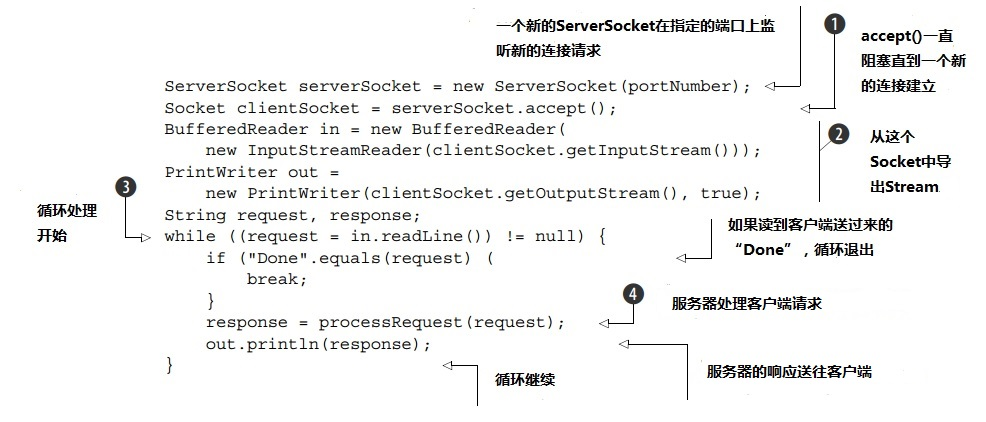
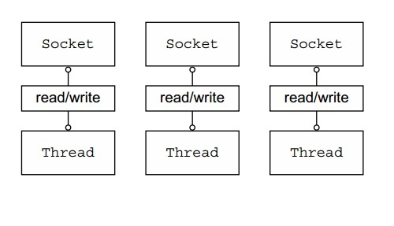
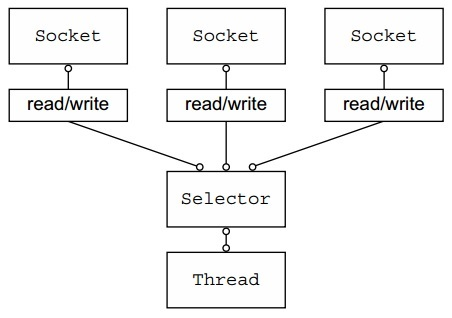
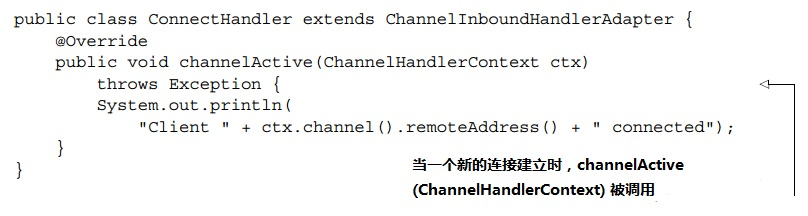
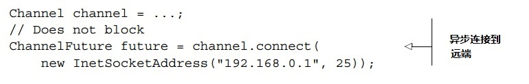
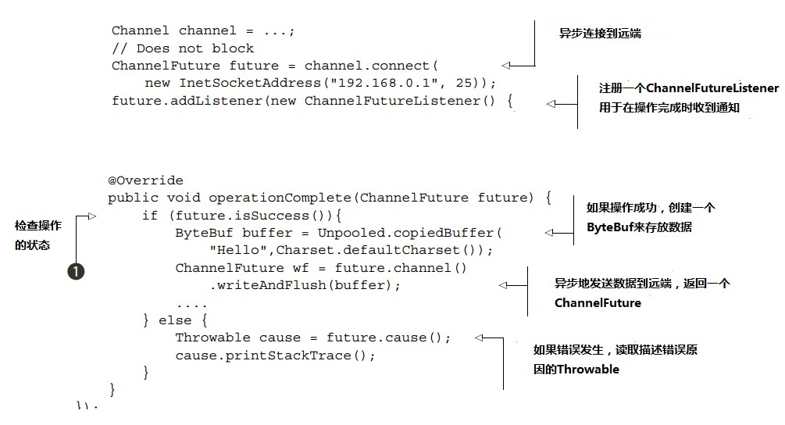

## 第一章   Netty—异步和事件驱动

### 目录
1.1 Java网络编程   
1.1.1 Java NIO   
1.1.2 Selectors

1.2 Netty简介   
1.2.1 谁用Netty？   
1.2.2 异步和事件驱动

1.3 Netty的核心组件   
1.3.1 Channels   
1.3.2 Callbacks   
1.3.3 Future   
1.3.4 Events和handlers   
1.3.5 汇总

1.4 小结

### 本章包含
- Java的网络编程   
- Netty初探
- Netty的核心组件
	
假设你即将要为一个重要的大公司开发一个新的关键任务的应用程序。在第一次会议上，你了解到这个系统必须能无性能损耗地扩展到支持15万个并发用户。这时所有的人都看着你，你会说什么？

 

如果你自信地说“没问题”，那么真心佩服你！但是我们中的大部分人可能还是说得更谨慎些，比如“听起来是可行的”。然后，一旦回到电脑前，我们就会开始搜索“高性能Java网络编程（high performance  Java networking）”。

 

如今，如果你搜索这个关键字，在第一页的结果中，你将会看到这个:

 

- Netty: Home
- netty.io/
- Netty是一个用于快速开发可维护的高性能协议服务器和客户端的异步的事件驱动网络应用框架

 

 

如果你像很多人一样，通过这种方式发现了Netty，那么接下来你也许就会浏览官网，下载代码，研读Javadocs和一些博客，同时开始写代码(start hacking)。如果你已经有了扎实的网络编程经验，你也许会取得很大的进步；否则的话，可能不会。

 

为什么这么说呢？实现像上述例子中的高性能系统需要超一流的编程技术，需要诸多复杂领域的经验，包括网络，多线程和并发。Netty让甚至是网络编程的新手都可以运用到这些专业知识。但到目前为止，缺少一份全面的指导使得这个习得过程变得很困难，所以才有了本书。

 

我们写这本书的主要目的是使Netty被最大可能范围的开发人员所接受。这包括那些有创新内容和服务，但是既没有时间也无意成为网络专家的人。如果你也是其中一员，我们相信你会惊喜地发现你会很快地准备好创建你的第一个Netty应用。另一方面，我们致力于支持那些寻找开发私有网络协议工具的高级开发者。

 

事实上，Netty确实提供了一个非常丰富的网络开发工具包，我们会花大部分的时间来探索它的性能。但是Netty终究是一个框架，它的架构方法和设计原则同它的技术内容一样重要。因此，我们还将会提到这些：

    关注点分离（解耦业务和网络逻辑）

    模块化和可重用性

    做为第一需求的易测性(Testability as a first-order requirement)

 

 

在第一章，我们先介绍高性能网络的背景，特别是高性能网络在Java开发套件（JDK）中的实现。在这个背景下，我们会引入Netty，以及它的核心概念和组件。到本章的结尾，你将会准备好tackle你的第一个基于Netty的客户端和服务器

 

 

### 1.1 Java网络编程

早年就开始网络编程的开发者会花很多时间学习C语言socket库的繁复细节，还要对付在不同操作系统上可能突然出现的异常。早期的Java版本（1995-2002）引入了一个面向对象的外观，来掩盖这些棘手的细节，但同时也创建了一个复杂的需要很多样本文件代码（boilerplate code）的客户端/服务器协议（和为了让这个协议工作顺畅大量查阅底层细节的工作）（and a fair amount of peeking under the hood to get it all working smoothly ）

 

那些第一代的Java APIs(java.net) 只支持本地系统的socket库提供的所谓阻塞函数。下面的代码清单

是服务器端代码调用这些函数的例子：

 

**代码清单 1.1  阻塞I/O举例**

这个代码清单实现了一个基本的Socket API 模式。最重要的几个要点：

    accept() 一直阻塞直到ServerSocket上的连接建立完成(1), 然后返回一个新的socket，用于客户端和服务器直接的通讯。然后ServerSocket继续监听新的连接

    BufferedReader和PrintWriter是从这个Socket的输入输出流中导出的(2)。前者可以从一个字符输入流中读入文本，后者用于打印格式化的对象到一个文本输出流

    readLine()阻塞直到读到以换行或者回车结尾的字符串(3)

    处理客户端请求(4)

 

 

这份代码一次只能处理一个连接。为了处理多个并发的客户端，你需要为每个新的客户端Socket分配一个新的线程，如图1.1所示

 

**图1.1 使用阻塞I/O的多个连接**

让我们考虑下这个方案可能带来的结果。首先，在任何时候，很多线程是休眠的状态，在等待输入输出数据。这可能是个资源的浪费。第二，每个线程，根据操作系统的不同，需要分配默认大小从64KB到1M不等的栈内存。第三， 即使一个Java虚拟机(JVM)物理上可以支持很大数量的线程，早在这个数量到达上限前，比如达到1万个连接的时候，上线文切换的开销就已经成了大问题。

 

虽然这个针对并发的方案对中小规模数量的客户端也许能接受，但支持1万或者更多并发连接所需的资源让这个方案远不够理想。幸运的是，我们还有其他选择。

 

 

#### 1.1.1 Java NIO

除了列在代码清单1.1里的阻塞系统调用底层代码(the blocking system calls underlying the code)， 本地的socket库早就包含了非阻塞调用，这实现了对网络资源使用的更多控制。

    用setsockopt()你可以配置sockets，如果没有数据，读/写调用会立即返回；原本，一个阻塞调用会一直阻塞（that is, if a blocking call would have blocked）；

    你可以通过用系统的事件通知API注册一组非阻塞sockets，来判断是否这些sockets中的任何一个有待读取的数据

 

2002年，Java在JDK1.4的java.nio包中开始支持非阻塞I/O。

 

是“新(new)”还是“非(non)”阻塞？

NIO一开始是新输入/输出（New Input/Output）的缩略词，但是这个Java API已经存在了够长的事件，所以不再那么新了。目前大部分使用者把NIO看做非阻塞的简称，而阻塞I/O是OIO或者说老输入/输出（old  Input/Output）。你也许还能碰到普通(plain) I/O的说法。

 

 

#### 1.1.2 Selectors

图2是一个非阻塞的例子，从事实上克服了前一小节那个例子的缺点。

**图1.2 使用Selector的非阻塞I/O**

Java.nio.channels.Selectors这个类是Java 非阻塞I/O实现的关键。它采用了事件通知API来表明在一组非阻塞sockets中，谁已经准备好读写。因为在任何时候任意读写的操作都会被检查它的完成状况，一个单独的线程，如图1.2所示，可以处理多个并发的连接。

 

总体上来说，这个模型比阻塞的I/O模型提供了更好的资源管理：

    很多连接被更少的线程处理，因此由内存管理和上下文切换带来的开销更少；

    当没有I/O需要处理时，线程可以被指派其他任务

 

虽然很多应用程序直接使用了Java NIO API，但是要安全地使用并且正确无误并非易事。特别在高负载下，可靠并且高效地在处理和指派I/O是一项困难和容易出错的任务。这个任务最好交给高性能网络专家-Netty。

 

 

### 1.2 Netty简介

不久以前，我们在一开始展现的那个场景—支持成千上万的并发用户—会被认为是不可能的事。如今，做为系统用户，我们认为这种能力是理所当然的，做为开发者，我们期望这个极限(bar)可以更高。我们知道，总会出现对更大吞吐量，更高扩展性的低成本需求。

 

不要低估上一个观点的重要性。我们从漫长而痛苦的经历中学习到，低层次APIs的直接使用会暴露复杂度，同时带来对稀缺技能的严重依赖。所以，一个面向对象的基本概念是：用简化的抽象隐藏底层实现的复杂性。

 

这个原则刺激了许多框架的出现，这些框架将常规编程任务封装成现成解决的方案，很多还和分布式系统开发密切相关。也许可以这么断言，所有的职业Java开发者熟悉至少一种框架。对于我们很多人来说，这些框架是必不可少的，不仅满足了我们的技术需求，也满足了我们的开发进度。

 

在网络编程领域，Netty是出色的Java框架。通过使用简单易用的API来享用到Java高级APIs的威力，Netty让你可以专注于真正让你感兴趣的东西——你的应用的独特价值。

 

在我们开始仔细了解Netty之前，请仔细看下表1.1中总结的Netty关键特性。有些是技术性的，其他则是结构性的或者有哲学意味的。在这本书中我们会不止一次再来回顾这些特性。

 

**表1.1 Netty特性总结**

| 分类  | Netty特性 |
| ------------- | ------------- |
| 设计  | 用于多种传输类型的统一API，包括阻塞和非阻塞。 简单但是强大的线程模型\n真正的无连接数据报socket支持 链式的支持复用的逻辑组 (Chaining of logic components to support reuse)  |
| 易用性  | 大量的文档(Javadoc)和例子库 除了JDK1.6+没有别的依赖（一些可选特性可能需要Java 1.7+和/或 额外的依赖）  |
| 性能 | 比core Java APIs更好的吞吐量和低延迟 因为池化和复用，减少了资源消耗 尽可能小的内存拷贝 |
| 鲁棒性 | 没有因为慢连接，快连接或者超载连接造成的OutOfMemeoryError 在高速的网络上消除了NIO应用不公平的读/写比例 |
| 安全 | 完整的SSL/TLS和StartTLS的支持 适用于受限的环境比如Applet或者OSGI中 |
| 社区推动 | 早发布，频繁发布 |

 

#### 1.2.1 谁用Netty？

Netty有一个活跃的不断成长的使用团体，除了一些流行的开源代码项目比如Infinispan，HornetQ，Vert.x，Apache Cassandra和Elastic seartch，还包括一些大公司，比如Apple，Twitter，Facebook，Google，Square和Instagram。他们都在核心代码里采用了Netty强大的网络抽象。在初创公司中，Firebase和Urban Airship在使用Netty，前者用于HTTP长连接，后者用于各种推送通知。

 

每当你用Twitter时，你就在用Finagle，一个用于内部系统通信的基于Netty的框架。Facebook在他们的Apache Thrift服务Nifty中用了Netty。可扩展性和性能是这两个公司的关注重点，同时他们也是Netty项目的定期贡献者。

 

反过来，Netty也从这些项目中获益，通过实现比如FTP，SMTP，HTTP，WebSocket和其他基于文本及二进制的协议，提高了Netty的应用范围和灵活性

 

#### 1.2.2 异步和事件驱动

我们会频繁用异步这个词，所以现在是阐明其背景的好时机。异步，也就是非同步的事件大家肯定很熟悉了。比如电子邮件：你可能，也可能不会立刻收到你发出的消息的回复，或者你会在发消息的同时收到一个意外的消息。异步的事件也可以有个有序的关系。比如你通常会在你问了问题之后才得到这个问题的答案，并且你在等答案的同时可以做一些别的事情。

 

在日常生活中，异步就这么发生了，所以你可能都没多想。但是要让一个电脑程序也这么工作会出现一些非常特殊的问题。本质上，一个异步和事件驱动的系统向会我们展现一个特殊的非常有价值的状态：它可以响应任何时候任何顺序发生的事件。

 

这个能力对于获取最高级别的可扩展性是很关键的。可扩展性是指“一个系统，网络或者程序能以扩展来满足持续增长的工作量的能力”

 

异步和可扩展性直接有什么联系呢？

    非阻塞网络调用让我们不用再一直等到操作完成：一个异步的方法立即返回，并且当完成时再直接或者稍后通知用户
    Selectors让我们可以用更少的线程监控许多连接事件的发生

 

把这些元素放在一起，采用非阻塞I/O，我们可以比阻塞I/O更快速更经济地处理非常大数目的事件。从网络编程的角度讲，这是我们希望创建的系统的关键，接下来你会看到，这也是Netty由下至上(from the ground up)设计的关键。

 

在下一小节我们会先了解下Netty的核心组件。目前，你可以把这些组件看成域对象而不是具体的Java类。过一段时间，我们会看到它们是如何协同合作来通知发生在网络上的事件，并且让这些事件变得可被处理的。

 

### 1.3 Netty的核心组件

在这一节我们会讨论Netty的主要组成模块：

    Channels
    Callbacks
    Futures
    Events和handlers

这些模块代表了不同类型的概念：资源，逻辑和通知。你的应用将会利用这些模块来获取网络和网络上的数据。

对每个组件，我们会给出一个基本的定义，并且在合适的情况下，用一个简单的代码实例说明它的用法。
 

#### 1.3.1 Channels

一个Channel是Java NIO的一个基本抽象。它代表了：一个连接到比如硬件设备，文件，网络socket等实体的开放连接，或者是一个能够完成一种或多种譬如读或写等不同I/O操作的程序

 

目前，可以把一个Channel想象成一个输入和输出数据的媒介。同样地，它可以被打开或者关闭，连接或者断开。

 

#### 1.3.2 Callbacks

一个callback就是一个方法，一个提供给另一个的方法的引用。这让另一个方法可以在适当的时候回过头来调用这个callback方法。Callbacks在很多编程情形中被广泛使用，是用于通知相关方某个操作已经完成最常用的方法之一。

 

Netty在处理事件时内部使用了callback；当一个callback被触发，事件可以被ChannelHandler的接口实现处理。下面的代码清单是这样一个例子：当一个新的连接建立后，ChannelHandler的callback方法channelActive()会被调用，然后打印一条消息。

 

**代码清单 1.2 ChannelHandler被一个callback触发**

 

#### 1.3.3 Future
一个Future提供了另一个当操作完成时如何通知应用的方法。Future对象充当了一个存放异步操作结果的占位符(placeholder)角色；它会在将来某个时间完成并且提供对操作结果的访问。

 

JDK搭载了接口java.util.concurrent.Future, 但是提供的接口实现只允许你手动检查操作是否已经完成，或者就一直阻塞到操作完成。这非常麻烦，所以Netty提供了它自己的ChannelFuture实现，用于执行异步操作。

 

ChannelFuture提供了额外的方法让我们可以注册一个或者多个ChannelFutureListener实例。监听者的callback方法operationComplete()在操作完成时被调用。然后监听者可以查看这个操作是否成功完成，还是出错了。如果出错了，我们可以从future获取Throwable。简单来说，ChannelFutureListener提供的通知机制免去了手动检查操作完成情况的麻烦。

 

每个Netty输出的I/O操作都会返回一个ChannelFuture；就是说，没有一个操作是阻塞的。就像我们之前所说的，Netty由下至上都是异步和事件驱动的。

 

代码清单1.3中，一个ChannelFuture做为一个I/O操作的一部分被返回。这里，connect()会无阻塞地直接返回，调用会在后台完成。什么时候会完成取决于多个因素，但是这个担心已经从代码里被抽离(abstract away)出来了。因为这个线程没有阻塞在等待这个操作完成，它可以同时做其他事情，因此更有效率地利用资源。

 

**代码清单1.3  异步连接**

代码清单1.4展示了如何利用ChannelFutureListener。首先你连接到一个远端。然后用connect()返回的ChannelFuture注册一个新的ChannelFutureListener。当监听器被通知连接建立时，检查状态(1)。如果这个操作成功，你写数据到这个Channel。否则你从ChannelFuture中读取Throwable。

 

**代码清单1.4  运作中的Callback**

注意错误处理完全取决于你，取决于某个具体错误施加的限制。比如说，连接错误发生时，你可以试着重连或者和另一个远端建立连接。

 

如果你认为一个ChannelFutureListener是一个callback的复杂版本，那你想对了。事实上，callbacks和Futures是互补的机制；两者结合起来构成了Netty的关键模块之一。

 

#### 1.3.4 Events和handlers

Netty用细分的events来通知我们状态的变化或者操作的状况。这让我们可以基于发生的events来触发适当的行为。这类行为可能包括

    日志记录
    数据传送
    流控制
    应用逻辑

 
Netty是一个网络编程框架，所以events按它们和输入或者输出数据流的关系来分类。可能被输入数据或者相关状态改变触发的events包括：

    活跃或者停用的连接
    读数据
    用户events
    错误events

 
而输出event则是会触发将来行为的操作的结果，可能会是：

    打开或者关闭到远端的连接
    写或者刷数据到一个socket

每一个event都可以被分派到一个用户实现的handler对象的方法。这是一个事件驱动的模型如何直接转变为应用模块的好例子。图1.3展示了一个event如何被一串这样的event handler处理。 

**图1-3 经过一串ChannelHandler的输入输出事件**

 
Netty的ChannelHandler提供了如图1.3中展示的handler的基本抽象。我们在适当的时候会更多地谈论到ChannelHandler，但是现在你可以认为每个handler实例就是一种响应某个具体event的callback。

Netty提供了大量你可以马上拿来用的预定义handler，包括HTTP和SSL/TLS等协议的handler。在内部，ChannelHandler自己也用events和futures，和你的应用是同样抽象的消费者。

 
#### 1.3.5 汇总

在这一章，你初次接触了Netty针对高性能网络编程的方案，以及Netty实现的一些主要模块。让我们把讨论过的东西总结下。
 

**FUTURES，CALLBACKS和HANDLERS**

Netty的异步编程模型是建立在Futures和callbacks概念之上的，在更深一层分派事件到handler方法。这些元素结合起来提供了一个处理环境，让你的应用逻辑可以逐步发展而不用关心网络操作。这一个Netty设计方案的一个关键目标。
 

快速地拦截操作和传送输入输出数据只要求你提供callbacks或者用操作返回的Futures。这让链式操作变得容易和有效，同时促进了可重用和通用代码的编写。
 

**SELECTORS, EVENTS, AND EVENT LOOPS**

Netty通过引发事件把Selector从应用中抽象出来，省掉了所有原本需要手写得调度代码。在内部，一个EventLoop被分配到每个Channel来处理所有的events，包括

    注册感兴趣的events

    分派events到ChannelHandlers

    安排将来的行为

EventLoop自己仅由一个线程驱动，这个线程处理一个Channel所有的I/O事件，这个关系在Eventloop的生命周期内不会改变。这个简单强大的设计消除了任何你可能对ChannelHandler同步的顾虑，因此你能够专注于在数据被处理时，提供正确的执行逻辑。在我们详细探讨Netty的线程模型时将会看到的，这个API简洁并且紧凑。

### 1.4 小结

在这一章，我们了解了Netty的背景，包括Java网络编程API的进化史，阻塞和非阻塞网络操作的区别，以及异步操作在高容量高性能网络方面的优势。

然后我们对Netty的特性，设计和优点进行了概述。涉及Netty异步模型下的机制，包括callbacks，Futures，和它们的组合使用。我们也提到了事件是如何产生的以及事件是如果被解析和处理的。

下一步，我们会更深入地探讨这个丰富的工具集是如何被用来满足你的应用的具体需求。

在下一章，我们会探究Netty API和编程模型的基本要点，而你会开始写你的第一个客户端和服务器。
