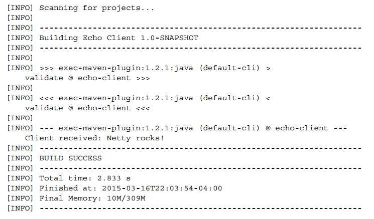

## 第二章   你的第一个Netty应用


### 本章包含：

    创建开发环境
    编写一个Echo服务器和客户端
    编译测试应用


在这一章我们将会向你展示如何创建一个基于Netty的客户端和服务器。这两个应用很简单—客户端送消息到服务器，服务器再将该消息送回客户端—不过，基于两个原因，这个练习很重要。


首先，它提供了一个创建和验证开发工具及环境的试验台。如果你打算用书里的示例代码来准备你自己的开发，那么这一点很重要。


第二，你能积累一些亲手实践前一个章节提到的Netty关键部分的经验：用ChannelHandlers来创建应用逻辑。这能帮你为从第三章开始的Netty API深入学习做好准备。

 
### 2.1 创建开发环境

为了编译和运行本书的例子，需要的工具只有JDK和Apache Maven，它们都是免费下载的。

 

我们假设你会希望对这些实例代码做一些小修改，并且很快开始写你自己的代码。虽然你可以用一个纯文本编辑器来实现这一点，我们强烈建议你采用Java的集成开发环境（IDE）。

 

#### 2.1.1 获取和安装Java开发套件

你的操作系统可能已经安装了JDK。在命令行中敲如下命令可以找到它：

 
```
javac -version
```
 

如果返回javac 1.7… 或者1.8… 说明你已经准备就绪那么就可以跳过这个步骤。

 

否则，从http://java.com/en/download/manual.jsp 下载第8版的JDK。注意要下载JDK而不是Java运行环境(JRE),JRE是用来运行Java应用而不是用来编译的。针对每个平台都提供了一个可执行安装程序。如果你需要安装指导，你也可以在该站点找到。

 

推荐按下面的步骤来做：

    把环境变量JAVA_HOME设置成你的JDK的安装位置（在Windows平台，默认的安装路径类似：C:\Program Files\Java\jdk1.8.0_60）
    把%JAVA_HOME%\bin（在Linux上是${JAVA_HOME}/bin）加入你的执行路径。

 

2.1.2 下载和安装一个IDE

下面几个是最广泛使用的Java IDEs，都是免费的：

    Eclipse—www.eclipse.org
    NetBeans—www.netbeans.org
    Intellij Idea Community Edition—www.jetbrains.com

 

这三个IDE都全面支持我们将会用的构建工具Apache Maven。NetBeans和Intellij是以可执行安装程序发布的。Eclipse通常是一个zip压缩档，虽然有很多定制版本可以自动安装。

 

#### 2.1.3 下载和安装Apache Maven

即使你已经熟悉Maven了，我们建议你至少浏览下这一节。

 

Maven是一个广泛使用的项目构建管理工具，由Apache软件公司开发。Netty项目用了Maven，本书的例子也用了。你不必先成为一个Maven专家才能编译和运行这些例子，但是如果想要扩展这些例子，我们建议你阅读本书附录部分的Maven入门。

 

你需要安装Maven吗？

Eclipse和NetBeans都内嵌了Maven安装，可以立即为我们所用。另外如果你工作在一个有自己Maven仓库的开发环境中，你的管理员可能已经有了一个Maven安装包以便预先配置到这个仓库。

 

到本书出版的时，最新的Maven版本是3.3.3。你可以从http://maven.apache.org/download.cgi为你的系统下载合适的tar.gz或者zip文件。安装很简单：提取压缩包的内容到你选择的目录（我们称为<install_dir>）。目录<install_dir>\apache-maven-3.3.3就创建好了。

 

关于Java环境，

    把环境变量M2_HOME配置成<install_dir>\apache-maven-3.3.3
    把%M2_HOME%\bin（或者在Linux上是${M2_HOME}/bin）加入你的执行路径。

 

#### 2.1.4 配置工具集

如果你已经按建议把JAVA_HOME和M2_HOME系统变量都配置好了，也许你会发现当你启动IDE时，它已经找到了Java和Maven的安装位置。如果你需要手动配置，所有我们这里列出的IDE版本都在Preferences或者Settings下面有菜单选项来配置这些变量。

 

这样就完成了开发环境的创建。在下面几个小节，我们会展示你创建的第一个Netty应用的细节，并且我们会深入探讨这个框架的API。接下来你将会用你刚搭建好的工具来编译和运行这个Echo服务器和客户端。

 

### 2.2 Netty服务器/客户端概览

图2.1是一个你即将开发的Echo服务器和客户端的高层视图(a high-level view)。虽然你会主要关注如何实现让浏览器访问的网络应用，通过实现服务器和客户端，你一定会对Netty API理解地更加全面。

 

**图2.1 Echo客户端和服务器**


虽然我们说的是"这个"客户端，但是这个图展示的是同时连到一个服务器的多个客户端。理论上，可支持的客户端数量是受可支配系统资源限制的（以及在用的JDK版本带来的限制）

 

Echo客户端和服务器之间的交互非常简单; 客户端建立一个连接后，它送一条或者多条消息到服务器，然后服务器再将该消息送回客户端。虽然这个交互看起来不那么实用，但却是一个典型的客户端/服务器系统请求-响应交互过程的示例。

 

我们先来看服务器端的代码。

 

### 2.3  开发Echo服务器

 

所有的Netty服务器都需要：

    至少一个ChannelHandler—这个组件实现了服务器如何处理从客户端收到的数据—它的业务逻辑。
    Bootstrapping—这是配置服务器的启动代码。至少要做的是，它把服务器绑到一个可以监听连接请求的端口上。

 
在这一节剩下的部分，我们会描述Eche服务器的业务逻辑和Bootstrapping代码

 

#### 2.3.1 ChannelHandlers和业务逻辑

在第一章我们介绍了Futures和callbacks，和它们在事件驱动设计中的使用。我们还讨论了ChannelHandler，它是一组接口的父类，这些接口的实现类接收并且响应事件通知。在Netty应用中，所有的数据处理逻辑都是包含在这些核心抽象(core abstractions)的实现类里的。

 

因为你的Echo服务器会响应收到的消息，所以它需要实现接口ChannelInboundHandler，这个接口定义了作用于输入事件的方法。这个简单的应用只需要这个接口的一些方法，所以用子类ChannelInboundHandlerAdapter就足够了，这个子类提供了ChannelInboundHandler的缺省实现。

 

我们感兴趣的是下面几个方法：

    channelRead()—每次收到消息时被调用
    channelReadComplete()—用来通知handler上一个ChannelRead()是被这批消息中的最后一个消息调用
    exceptionCaught()—在读操作异常被抛出时被调用

 

Echo服务器的ChannelHandler实现是EchoServerHandler，如下清单所示：

 

**代码清单2.1 EchoServerHandler**


ChannelInboundHandlerAdapter有简明直接的API，每个方法都可以被重写(overridden)，钩挂到(hook into)event生命周期的适当时间点。因为你需要处理所有收到的数据，所以你得重写channelRead()。在这个服务器里，你只要简单地把收到的消息送回远端。

 

重写exceptionCaught()让你可以对任何Throwable的子类型做出反应—在这里，你打印了这个异常然后关闭了这个连接。一个更加复杂的应用也许会试着从异常中恢复，但是在这个例子中，仅仅把连接关闭就向远端发出了错误已经发生的信号。

 

如果异常没有被捕获会发生什么？

每个Channel有一个对应的ChannelPipeline，这个ChannelPipeline有一串ChannelHandler实例。默认情况下，一个handler会传递某个handler方法的调用到下一个handler。所以，如果在这个传递链中exceptionCaught()没有实现，异常会一直走到ChannelPipeline的终点，然后被载入日志。因为这个原因，你的应用应该提供至少一个实现了exceptionCaught()的handler。(6.4 小节会详细讨论异常处理)

 

除了ChannelInboundHandlerAdapter，还有许多其他ChannelHandler子类和实现可以学习。我们会在第六和第七章详细讨论。现在，请记住这几个要点：

    ChannelHandlers被不同类型的events调用
    应用程序通过实现或者扩展ChannelHandlers来钩挂到event的生命周期，并且提供定制的应用逻辑
    在结构上，ChannelHandlers解耦你的业务逻辑和网络代码。这会简化开发过程，因为代码会随着需求的变化而变化。

 

#### 2.3.2 Bootstrapping服务器

我们已经讨论了由EchoServerHandler实现的核心业务逻辑，现在我们可以来仔细看下服务器的boostrapping过程，这包括：

    绑定到一个端口，服务器在这个端口上监听并且接收新的连接请求
    配置Channels，来通知EchoServerHandler实例收到的消息

 

**传输**

在这一节，你会碰到传输(transport)这个词。标准上，在网络协议的多层视图中，传输层用来提供端对端或者主机对主机通信的服务。

 

互联网通信是建立在TCP传输的基础上的。NIO传输(NIO transport)指的是一个类似于TCP传输的方式，不过它服务器端的性能增强由Java NIO的实现带来的

 

传输将会在第四章详细讨论。

 

下面的代码清单是EchoServer类的完整代码：

 

**代码清单2.2 EchoServer类**


 

在(2)中，你创建了一个ServerBootstrap实例。因为你在用NIO传输方式，你指定使用NioEventLoopgroup(1)来接收和处理新的连接，使用NioServerSocketChannel(3)做为channel类型。在你用已选的端口来配置InetSocketAddress的本地地址之后(4)，服务器就会绑定到这个地址，来监听新的连接请求。

 

在(5)你用了一个特殊的类，ChannelInitializer。这是关键。当一个新的连接被接收时，一个新的子Channel会被创建，然后这个ChannelInitializer会把一个EchoServerHandler实例加到这个Channel的ChannelPipeline中。像我们之前解释的那样，这个handler会接收有关输入消息的通知。

 

虽然NIO是有扩展性的，它的合理配置，特别是涉及到多线程时，并不容易，而Netty的设计封装了大部分的复杂性。我们会在第三章更详细地讨论相关的抽象（EventLoopgroup，SocketChannel，和ChannelInitializer）。

 

接下来你绑定服务器(6)然后一直等到绑定完成。（调用sync()让当前线程一直阻塞）。在(7)，这个应用程序会一直等到这个服务器的Channel关闭（因为你在Channel的CloseFutures上调用了sync()）。然后你可以关闭EventLoopgroup，释放所有资源，包括创建的线程(8)。

 

这个例子中用到了NIO，因为鉴于它的可扩展性和完全的异步性，NIO是使用最广泛的传输方式。但是你也可以用一个不同的传输实现。如果你想要在你的服务器中用OIO传输方式，你可以指定OIOServerSocketChannel和OIOEventLoopgroup。我们会在第四章详细讨论传输。

 

同时，让我们回顾下你刚实现的服务器的关键步骤。这些是这个服务器的关键代码部分：

    EchoServerHandler实现业务逻辑
    main()方法启动(bootstrap)服务器

 

以下是Bootstrapping中的必需步骤：

    创建一个ServerBootstrap实例来启动和绑定服务器
    创建并且分配一个NioEventLoopgroup实例来处理event，比如接受新的连接和读/写数据
    指定本地InetSocketAddress到服务器绑定的端口
    用一个EchoServerHandler实例来初始化每个新的Channel
    调用ServerBootstrap.bind()来绑定服务器。

 

到这里服务器已经初始化完成，准备使用了。在下一小节，我们来仔细看下客户端应用的代码。

 

### 2.4 开发Echo客户端

Echo客户端会：

    连接到服务器
    送出一条或者多条消息
    对每条消息，等待并且从服务器收回一条同样的消息
    关闭连接

 

开发客户端包括你在服务器端看到的两部分代码：业务逻辑和Bootstrapping。

 
#### 2.4.1 用ChannelHandlers使用客户端逻辑

和服务器一样，客户端会有一个ChannelInboundHandler来处理数据。这个例子中，你会扩展SimpleChannelInbondHandler类来处理所有的任务，如代码清单2.3所示。这需要重写下面这些方法：

    channelActive()—和服务器的连接建立起来后被调用
    channelRead0()—从服务器收到一条消息时被调用
    exceptionCaught()—处理过程中异常发生时被调用

 

**代码清单2.3 客户端的ChannelHandler**


 

首先你重写了channelActive()，在一个连接建立的时候被调用。这保证了可以尽快地写一些数据到服务器，在这个例子中，是一个包含“Netty rocks!”字符串的字节缓冲区。

 

然后你重写了channelRead0()方法。每当收到数据时，这个方法会被调用。注意服务器发送的数据可能被分块收到。就是说，如果服务器送出5字节，不能保证所有的5字节会被一次性收到。即使对这么小的数据量，channelRead0()方法可能会被调用两次，第一次用一个ByteBuf（Netty的字节容器）存放3字节，第二次用一个ByteBuf存放2字节。作为一个面向流的协议，TCP会保证字节会按它们从服务器发出的顺序被收到。

 

你重写的第三个方法是exceptionCaught()。就像在EchoServerHandler中，Throwable被载人日志并且channel被关闭，在这个例子中channel被关闭导致和服务器连接的终止。

 

SimpleChannelInboundHandler对比ChannelInboundHandler

你也许想知道为什么我们在客户端用了SimpleChannelInboundHandler，而不是EchoServerHandler中用的ChannelInboundHandlerAdapter。这和两个因素有关：业务逻辑如何处理消息，以及Netty如何管理资源。

 

在客户端，当channelRead0()完成时，你收到输入消息并且已经处理完成。当这个方法返回时，SimpleChannelInboundHandler会负责释放用于存放消息的ByteBuf的内存引用。

 

在EchoServerHandler中，你仍然要把输入的消息送回给发送端，而write()操作是异步的，直到channelRead()返回可能都没有完成（如代码清单2.1所示）。所以，EchoServerHandler扩展了ChannelInboundHandlerAdapter，不会在channelRead()返回的时候释放消息的内存引用。

 

在writeAndFlush()被调用时，这个消息的内存引用会在EchoServerHandler的channelReadComplete()方法中被释放（代码清单2.1）。

 

第五和第六章会详细覆盖消息资源的管理。

 

### 2.4.2 Bootstrapping客户端

你会在下一个代码清单中看到，bootstrapping一个客户端和bootstrapping一个服务器类似，不同于服务器绑定到一个监听端口，客户端用主机和端口参数来连接到一个远程地址，这里就是指Echo服务器。

 

**代码清单2.4  客户端的主类**


跟之前一样，使用的是NIO传输方式。注意，你在客户端和服务器中可以用不同的传输方式；比如，服务器端用NIO，在客户端用OIO。在第四章我们会分析一些因素和情景，让你为一个特定的使用案例选择一个特定传输方式。

 

让我们回顾下这一小节中的关键点：

    创建一个Bootstrap实例来初始化客户端
    分配一个NioEventLoopgroup实例来处理事件，包括创建新的连接和处理输入输出数据
    创建一个InetSocketAddress用于连接到服务器
    当连接建立，一个EchoClientHandler会被装入pipeline
    所有东西都创建完毕后，调用Bootstrap.connet()连接到远端。

 

完成客户端开发后，你可以接着编译和测试这个系统。

 

### 2.5 编译和运行Echo服务器和客户端

在这一小节，我们会覆盖编译和运行Echo服务器和客户端需要的所有步骤。


Echo 客户端/服务器的Maven工程

这本书的附录用Echo 客户端/服务器工程的配置来详细解释了多模块的Maven工程师如何组织起来的。编译和运行应用程序并不要求去阅读这一部分，但是为了更好地理解本书的例子和Netty工程本身，推荐阅读。

 

#### 2.3.1 编译

编译Echo客户端和服务器，到示例代码根目录下的chapter2目录，然后执行下面的命令

 
```
mvn clean package
```
 

这应该会输出类似代码清单2.5所示（我们编辑掉了一些编译中非关键的步骤）

 

代码清单2.5 编译Echo客户端和服务器

 

这是编译log中的主要步骤：

    Maven决定编译顺序：首先是父pom.xml，然后是各模块（子工程）
    如果在用户的本地仓库中找不到Netty artifacts，Maven会从公共的Maven仓库中下载（这里没有显示）
    运行编译周期的clean和compile阶段
    执行maven-jar-plugin

 

Maven Reactor Summary表明所有的工程都编译成功。现在这两个子工程的target目录清单应该跟下面这个类此：

 

**代码清单2.6 编译artifacts**


#### 2.5.2 运行Echo服务器和客户端

为了运行应用组件，你可以直接用Java命令。但是在这个POM文件中，配置了exec-maven-plugin来帮你运行（详见附录）

 

并排打开两个控制台窗口，一个进入chapter2\Server目录，另一个进入chapter2\Client。

在服务器的控制台，执行这个命令：

```
mvn exec:java
```
 

你应该看到与以下相似的输出：

 

这个服务器已经启动好并且准备接收连接。现在在客户端的控制台执行同样的命令：

mvn exec:java

 

你应该看到以下的输出：


然后在服务器的控制台你应该看到这个：

 
```
Server received： Netty rocks!
```
 

每次你运行客户端，你就会在服务器的控制台看到这条日志语句。

 

这里发生了：

    一旦客户端连接，它发送“Netty rocks!”消息
    服务器打印收到的消息并且再送回客户端
    客户打印送回的消息然后退出

 

你现在看到的是我们期待的行为；现在让我们来看下失败是如何被处理的。服务器应该仍然在运行，所以在服务器控制台敲Ctrl-C命令来终止进程。一旦终止，再一次启动客户端：

 
```
mvn exec:java
```
 

以下是当客户端无法连上服务器时你应该从客户端看到的输出：

 

代码清单2.7 Echo客户端的异常处理


 

发生了什么？客户端试图连接运行在localhost:9999的服务器。因为服务器之前已经停止了，所以失败了（意料中），在客户端抛出了java.net.ConnectException。这个异常触发了EchoClientHandler的exceptionCaught()方法，这个方法打印了栈跟踪信息然后关闭这个channel（见代码清单2.3）。

 

### 2.6 小结

在这一章你创建了你的开发环境，编译和运行了你的第一个Netty客户端和服务器。虽然这是一个简单的应用，但是它可以扩展到支持几千个并发的连接—每秒比一个普通的基于socket的Java应用能处理更多的消息。

 

在接下里的章节里，你会看到更多Netty如何简化可扩展性和并发的例子。我们也会深入到Netty对关注点分离(separation of concerns)结构原则的支持。通过提供对解耦业务逻辑和网络逻辑的正确抽象，Netty使跟上快速发展的需求并且不破坏系统稳定性变得更加容易。

 

在下一章，我们会提供Netty结构的概述。这将提供给你一个在接下来的章节中深入并且全面学习Netty内部实现的背景。


