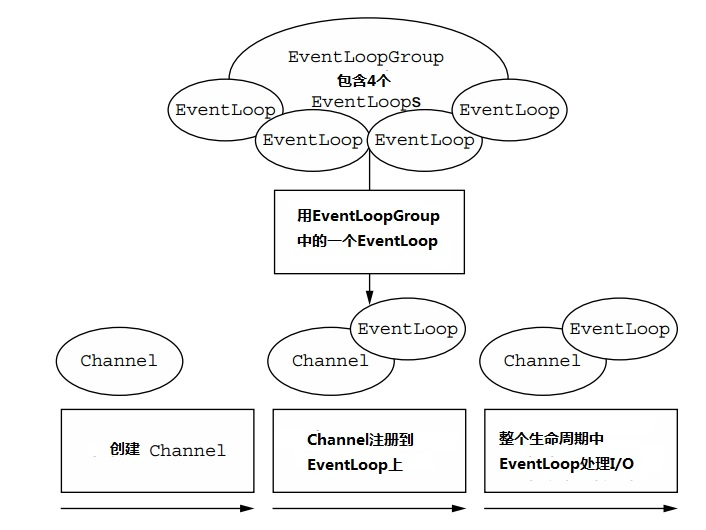

## 第三章   Netty的组件和设计

### 本章包含

    Netty的技术和架构方面
    Channel，EventLoop和ChannelFuture
    ChannelHandler和ChannelPipeline
    Bootstrapping

 

在第一章我们总结了Java高效能网络编程的历史和技术基础，这为概述Netty的核心概念和构造模块提供了一个背景。

 

在第二章我们把讨论范围扩展到应用开发。通过创建一个简单的客户端和服务器你学到了bootstrapping，获得了一些亲自实践核心ChannelHandler API的经验。与此同时，你也验证了你的开发工具是可以正常工作的。

 

以这些内容为基础，在本书剩下的部分，我们会从两个不同但是密切联系的角度来研究Netty：做为一个类库和做为一个框架。这两个方面对用如何Netty开发高效，可重用，可维护的代码都很关键。

 

从一个高层次的角度来看，Netty解决了两个相应领域的问题，我们可以大体上称其为技术上的(technical)和结构上的(architectural)。首先，它的异步和事件驱动基于Java NIO实现，在高负载下能保证最好的应用性能和可扩展性。第二，Netty包含了一系列用来解耦应用逻辑和网络层的设计模式，简化了开发的同时最大限度地提升了可测试性，模块化和可重用性。

 

随着我们更具体地学习Netty的单个组件，我们将会密切关注这些组件是如何配合来支持结构的最佳实践(best practices)。遵循同样的原则，我们就能收获Netty提供的所有好处。在这个目标的指引下，在这一章，我们会回顾下到目前为止我们已经介绍过的主要概念和组件。

 

### 3.1 Channel，EventLoop和ChannelFuture

下面几个小节会对我们讨论的Channel，EventLoop和ChannelFuture类增加一些细节，它们合起来可以被看成是Netty的网络抽象(Networking abstraction)：

    Channel—Sockets
    EventLoop—控制流，多线程，并发
    ChannelFuture—异步通知

 

#### 3.1.1 接口Channel

基本的I/O操作（bind()，connect()，read()和write()）依赖于底层网络传输层提供的基本类型(primitives)。在基于Java的网络编程中，基本的构造单元就是Socket类。Netty的Channel接口提供了一个API，极大地降低了直接使用Socket的复杂性。另外，Channel是一个包含大量预定义，有专门用途的类层次结构(class hierarchy)中的根元素，下面只是列出了其中的一些部分：

    EmbeddedChannel
    LocalServerChannel
    NioDatagramChannel
    NioSctpChannel
    NioSocketChannel

 

#### 3.1.2 接口EventLoop

EventLoop定义了Netty的核心抽象，用来处理发生在一个连接生命周期中的事件。我们会在第七章讲Netty的线程模型时详细讨论EventLoop。现在，图3.1从高层次展现了Channel，EventLoop，Thread和EventLoopGroup之间的关系。

这些关系是指：

    一个EventLoopGroup包含一个或者多个EventLoop
    所有的EventLoop在它的整个生命周期里都绑定在一个线程上
    所有被一个EventLoop处理的event都是由EventLoop绑定的线程处理的
    一个Channel在它的生命周期内只注册到一个EventLoop上
    一个EventLoop可以被分配给一个或者多个Channel。
 

**图3.1 Channels，EventLoops和EventLoopGroups**

注意，某一个Channel的所有I/O由同一个线程执行这个设计，实际上省去了同步的需要。

 

#### 3.1.3 接口ChannelFuture

如同我们之前解释的，Netty中所有的I/O操作都是异步的。因为一个操作可能不会立刻返回，我们需要一个方法在稍后的时间来判定它的结果。因此，Netty提供了ChannelFuture，它的addListener()方法注册一个ChannelFutureListener，当操作完成时可以收到通知（无论成功与否）。

 

**更多关于CHANNELFUTURE**

把一个ChannelFuture看成一个容器(placeholder)，存放在未来执行的操作的结果。这个操作何时会被执行取决于几个因素，因此不可精确预测，但是确信的是它会被执行。另外，所有属于同一个ChannelFuture的操作都会保证按调用的顺序来执行

 

我们会在第七章深入讨论EventLoop和EventLoopGroup。

 

## 3.2 ChannelHandler和ChannelPipeline

现在我们来仔细看下负责管理数据流和执行应用程序处理逻辑的Netty组件。

 

#### 3.2.1 接口ChannelHandler

从应用开发者的角度来看，Netty的主要组件是ChannelHandler，它作为一个应用逻辑的容器，处理输入输出数据。这成为可能，是因为ChannelHandler的方法是被网络事件（这里的事件是广义的）触发的。事实上，一个ChannelHandler可以被用于几乎任何类型的行为，比如转换数据格式，处理抛出的异常。

 

举例来说，ChannelInboundHandler是一个你将会经常实现的子接口。这个类型接收输入事件和数据后，让你的应用业务逻辑处理。在你给一个连接的客户端发送响应的时候，你也能在一个ChannelInboundHandler里刷新(flush)数据。你的应用业务逻辑通常会存在一个或者多个ChannelInboundHandler中。

 

#### 3.2.2 ChannelPipeline接口

一个ChannelPipeline为一串ChannelHandler提供了一个容器，同时定义了在这一串ChannelHandler中传送输入输出事件的API。当一个Channel被创建，它会自动被分配一个ChannelPipeline。

 

ChannelHandler按如下步骤安装到ChannelPipeline中：

    一个ChannelInitializer接口实现被注册到一个ServerBootstrap
    当ChannelInitializer.initChannel()被调用时，这个ChannelInitializer会往管道(pipeline)中安装定制的一组ChannelHandler
    然后这个ChannelInitializer把自己从ChannelPipeline中移除

 

让我们来深入了解下ChannelPipeline和ChannelHandler之间的共生关系(symbiotic relationship)，来检验当你发送或者接收数据的时候发生了什么。

 

ChannelHandler特地被设计来支持广泛的应用，你可以把它看成是一个代码的通用容器，这些代码用来处理往来ChannelPipeline的事件（包括数据）。这在图3.2中可以看出，ChannelInboundHandler和ChannelOutBoundHandler衍生自ChannelHandler。

 

**图3.2 ChannelHandler类层次结构**

Machine generated alternative text: 玦nterface? ChanneiHandler 玦nterface? Channel InboundHandler 玦nterface? Charme lOutbound}Iandl er

让一个event在这个管道中运转是ChannelHandler们的工作，ChannelHandler在初始化(initialization)阶段或者应用的bootstrapping阶段被安装在ChannelPipeline中。这些ChannelHandler对象接收event，执行已经实现了的处理逻辑，然后传递数据到链中的下一个handler。ChannelHandler执行的顺序按照它们被添加到ChannelPipeline中的顺序。实际上，我们正是把ChannelHandler的有序排列称作ChannelPipeline。

 

**图3.3 包含输入和输出ChannelHandler的ChannelPipeline**

 

图3.3展示了在Netty应用中输入(inbound)和输出(outbound)数据流之间的区别。从一个客户端应用的角度来看，如果event是从客户端到服务器的，那么这些event是输出的，反之是输入的。

 

图3.3还说明了输入和输出handlers可以被安装在同一个管道中。如果一条消息或者其他任何的输入event被读取，它会从管道的头部开始，然后被传送到第一个ChannelInboundHandler。根据handler的具体功能，这个handler也许会改动，也可能不改动这条数据，然后数据会被传送到链中的下一个ChannelInboundHandler。最后，数据到达管道的尾部，所有的处理结束。

 

数据的输出运动（也就是写数据）在概念上类似。这个例子里，数据从管道尾部流出，穿过ChannelOutBoundHandler链直到达到头部。之后，输出数据会到达网络层，如图所示是一个Socket。通常，这会触发一个socket的写操作。

 

**更多关于输入和输出handlers**

通过利用每个方法提供的输入参数ChannelHandlerContext，一个event可以被转发到当前链中的下一个handler。因为有时候你会忽略不感兴趣的event，所以Netty提供了抽象基类ChannelInboundHandlerAdapter和ChannelOutBoundHandlerAdapter。它们都提供了一些方法，只需简单地通过调用ChannelHandlerContext上相应的方法，把可以event传送到下一个handler。你可以通过重写你感兴趣的方法来扩展这些类。

 

鉴于输出和输入操作是不同的，你也许会想知道当两类handler被混在同一个ChannelPipeline中会发生什么。虽然输入和输出handler都扩展自ChannelHandler，但是Netty可以区分ChannelInboundHandler和ChannelOutBoundHandler的实现，并且确保数据只通过同一方向类型的handler。

 

当一个ChannelHandler被加入一个ChannelPipeline时，就被分配了一个ChannelHandlerContext。ChannelHandlerContext代表了一个ChannelHandler和ChannelPipeline直接的绑定关系。虽然说ChannelHandlerContext这个对象可以被用来获取底层的Channel，但是它主要是被用来写输出数据的。

 

Netty中有两种发送消息的方法。你可以直接写到Channel中，或者写到一个ChannelHandler相关的ChannelHandlerContext中。前者让消息从ChannelPipeline的尾部开始发送，而后者让消息从ChannelPipeline中的下一个handler开始发送。

 

#### 3.2.3 进一步了解ChannelHandler

像我们之前说的，有很多不同种类的ChannelHandler，而且每一个ChannelHandler的功能主要由它的父类决定。Netty以适配器类(adapter classes)的形式，提供了很多缺省handler实现，以此来简化应用处理逻辑的开发过程。你刚才已经看到了，一个管道里的每个ChannelHandler都负责转发event到链中的下一个handler。这些适配器类（和它们的子类）自动地完成这些转发，因此你可以只重写那些你想要特别实现的方法和event。

 

**为什么要用适配器？**

有一些适配器类把写定制(custom) ChannelHandler的麻烦减小到了最低，因为它们提供了定义在相应接口中所有方法的缺省实现。

这些是你在创建你的定制handler时经常会用到的适配器。

    ChannelHandlerAdapter
    ChannelInboundHandlerAdapter
    ChannelOutboundHandlerAdapter
    ChannelDuplexHandlerAdapter

接下来，我们来仔细看下三种ChannelHandler的子类型：编码器(encoders)，解码器(decoders)，和一个ChannelInboundHandlerAdapter的子类SimpleChannelInboundHandler<T>。

 

#### 3.2.4 编码器和解码器

当你用Netty发送或者接收数据的时候，数据转换发生了。一条输入数据会被解码，就是说，从字节转换到另一种格式，通常是一个Java对象。如果这条消息是输出的，则反之：它会从当前格式被编码成字节。这两次转换的原因很简单：网络数据总是一个字节序列。

 

根据相应的特殊用途，Netty给不同的编码器和解码器提供了各种类型的抽象类。比如，你的应用可能要用一种中间数据格式，不需要消息被立刻转换成字节。你还是会需要一个编码器，但是它会来自一个不同的父类。为了确定用什么合适的编码器，你可以参考一个简单的命名规则。

 

通常，基类会有一个类似ByteToMessageDecoder或者MessageToByteEncoder的名字。如果是特殊的类型，你可能会找到一些比如ProtobufEncoder和ProtobufDecoder，它们被用来支持Google的protocol buffers。

 

严格地来说，其他handler也可以做编码器和解码器做的事。但是就如同适配器（的设计）是为了简化channel handler的创建，Netty提供的所有编码器/解码器适配器类不是实现了ChannelInboundHandler就是ChannelOutBoundHandler。

 

你会发现针对输入数据，channelRead方法/事件被重写了。从输入Channel读到的每条消息都会调用这个方法。然后输入数据会调用解码器的decode()方法，然后转发解码后的字节到管道中的下一个ChannelInboundHandler。

 

输出消息的模式正好相反：一个编码器把消息转成字节，然后转发到下一个ChannelOutBoundHandler。

 

#### 3.2.5 抽象类SimpleChannelInboundHandler

你的应用会很频繁地采用一个接受解码消息然后将业务逻辑应用到数据上的handler。为了创建这样一个ChannelHandler，你只需要扩展基类SimpleChannelInboundHandler<T>，这里T是你待处理消息的Java类型。在这个handler里，你要重写一个或者多个基类的方法，（在每个方法里）获取ChannelHandlerContext的引用，这个引用做为一个输入参数传送给这个handler的所有方法。

 

这个类型的handler中最重要的方法是channelRead0(ChannelHandlerContext,T)。它的实现完全取决于你，除了不能阻塞当前I/O线程这个要求。我们随后会更多地讨论这个话题。

 

 

### 3.3 Bootstrapping

Netty的bootstrap类为一个应用的网络层配置提供了容器，包括绑定一个进程到给定的端口，或者将一个进程连接到跑在另一个特定主机和端口上的进程。

 

通常，我们把前一个用例称为bootstrapping一个服务器，后一个称为bootstrapping一个客户端。这些专业术语很简单方便，但是却掩盖了“服务器”和“客户端”这两个词代表了不同的网络行为这样一个重要事实；这两个不同的网络行为是指，监听收到的连接，和用一个或多个进程建立连接。

 

**面向连接的协议**

请记住，严格来说“连接”这个词只用于面向连接的协议，比如TCP，保证连接端点之间消息的有序传送。

 

相应地，有两种类型的bootstrap：一个用于客户端（简称为Bootstrap），另一个用于服务器（ServerBootstrap）。无论你的应用采用哪种协议，或者处理哪种类型的数据，决定用哪个Bootstrap类取决于你的应用是作为一个客户端还是服务器。表3.1比较了这两种类型的bootstraps。

 

**表3.1 Bootstrap类的比较**

| 类型 | Bootstrap | ServerBootstrap | 
| ------------- | ------------- | ------------- |
| 网络功能 | 连接到一个远程主机和端口 | 绑定到一个本地端口 |
| EventLoopGroups数量 | 1 | 2 |

这两种类型的bootstraps的第一个区别已经讨论过了：一个ServerBootstrap绑定一个端口，因为服务器必须要监听连接；而Bootstrap用于想要连接到一个远端(a remote peer)的客户端应用。

 

第二个区别也许更重要些。Bootstrapping一个客户端只需要一个EventLoopGroup，但是一个ServerBootstrap需要2个（可以是同一个实例）。为什么呢？

 

一个服务器需要两组不同的Channel。第一组包含一个绑定到一个本地端口，代表了服务器自身监听socket的ServerChannel。第二组包括所有用来处理收到连接的Channel—每个被服务器接受的连接。图3.4展示了这个模型，同时表明了为什么需要两个不同的EventLoopGroup。

 

图3.4 包含两个EventLoopGroup的服务器

ServerChannel关联的EventLoopGroup分配一个EventLoop来负责创建处理连接请求的Channel。一旦一个连接被接受，第二个EventLoopGroup会分配一个EventLoop给这个连接的Channel。

 

### 3.4 小结

在这一章我们讨论了从技术和结构这两个角度理解Netty的重要性。我们详细回顾了一些之前已经介绍过的概念和组件，特别是ChannelHandler，ChanelPipeline和bootstapping。

特别地，我们讨论了ChannelHandler的类层次结构，介绍了编码器和解码器，描述了他们在数据和网络字节格式之间来回转换的互补功能(complementary functions)。

 
接下来的很多章节致力于深入学习这些组件，这一章的总览应该已经帮你聚焦了全局(keep the big picture in focus)。

下一章会探讨Netty提供的网络传输类型，以及如何选择最适合你的应用的类型。
