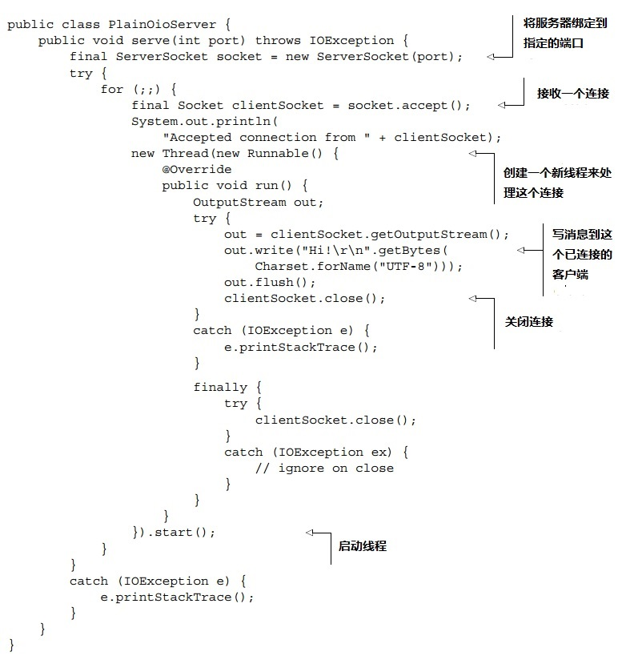
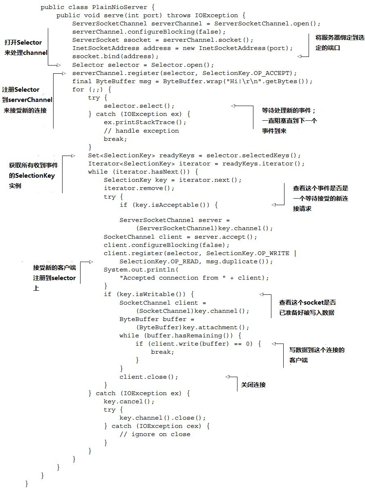
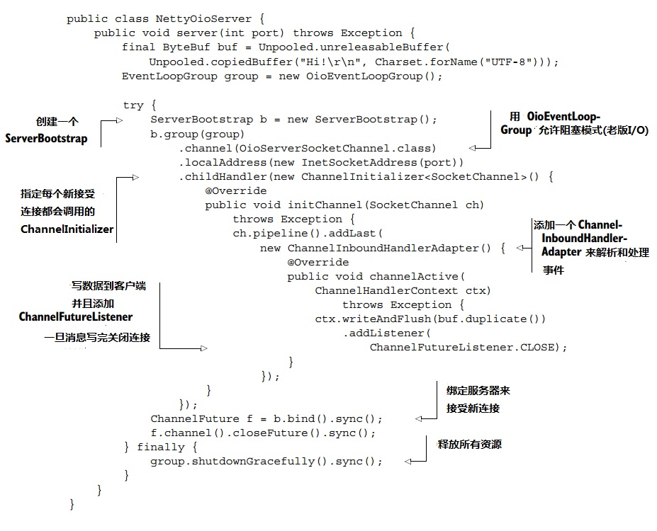
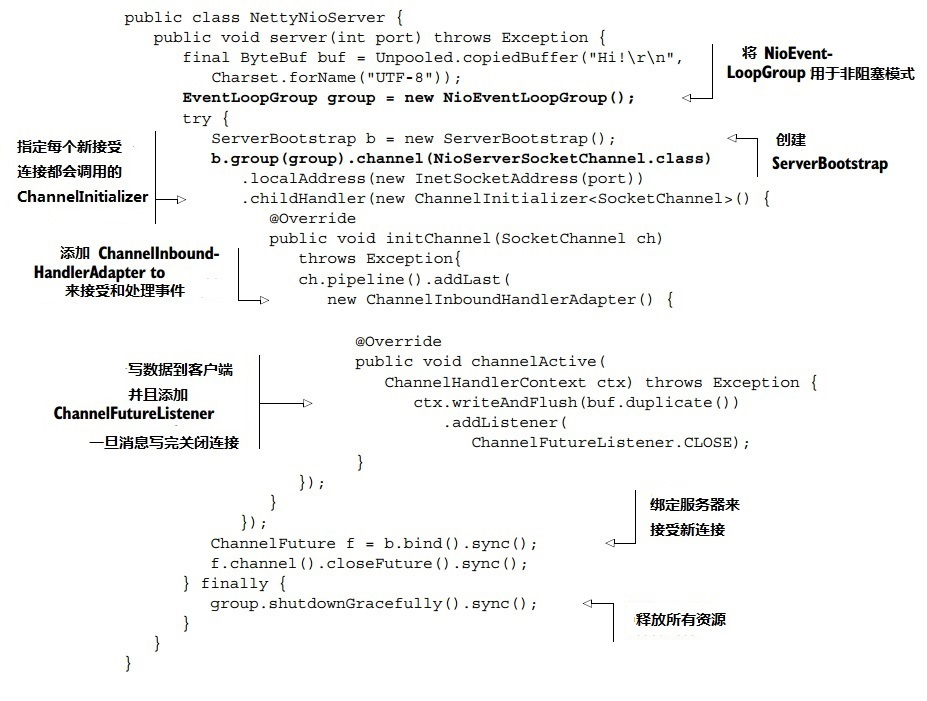
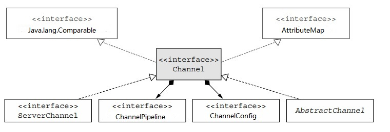
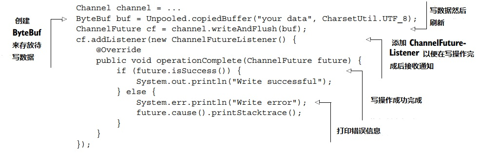
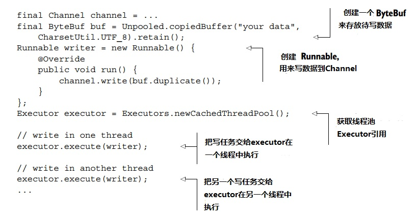
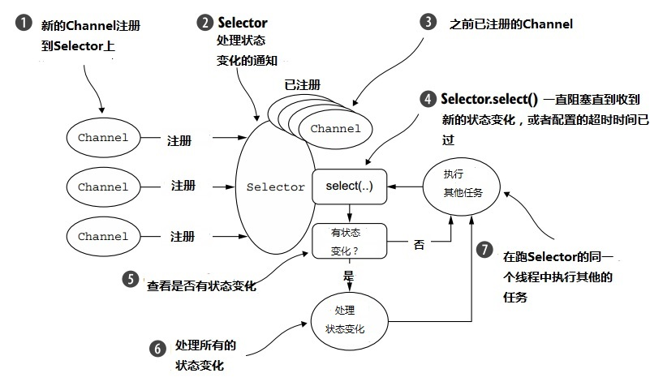

## 第四章   传输

### 本章包含

    OIO—阻塞传输
    NIO—异步传输
    本地传输—JVM内部的异步通信
    嵌入式传输—测试你的ChannelHandler


经过一个网络的数据通常是同一种类型：字节。这些数据是如何移动的基本上取决于被我们称之为网络传输的概念，这个概念帮我们抽象了底层的数据传输机制。用户不关心细节，他们只关心他们的字节数据被可靠地传送和接收。


如果你有Java网络编程的经验，你也许会在某个时刻发现，你需要支持比预料还要多的并发连接。接下来，如果你试着从一个阻塞的传输方式切换到非阻塞的，你很可能会碰到一些问题，因为这两种网络API是很不一样的。

 

然而，Netty在它所有的传输实现上覆盖了一层通用的API，让这样一种转换比直接用JDK实现容易的多。

 

你生成的代码不会受传输实现细节的影响，你也不用大量地重构你的整个代码。简而言之，你花时间做了有效率的事。

 

在这一章，我们会学习这个通用的API，通过和JDK做对比来展现它更为强大的易用性。我们会解释Netty每种传输方式的实现细节和适合的用例。有了这些信息，你会发现更容易为你自己的应用选择最好的方式。

 

阅读本章唯一的先决条件是对Java编程有一定的了解。有网络框架和网络编程的经验就更好了，但不是必须的。

 

首先我们来看在一个真实的场景中传输是如何工作的。

 

### 4.1 案例学习：传输方式迁移

我们会用一个应用来开始传输的学习，这个应用仅仅接收一个连接，然后写“Hi!”到客户端，接着关闭这个连接。

 

#### 4.1.1 不用Netty实现OIO和NIO

首先我们呈现的是这个应用只用了JDK API的阻塞(OIO)和异步(NIO)的版本。下面这段代码是阻塞的实现。如果你体验过用JDK进行网络编程的“乐趣”，那么这段代码会勾起你“美好的回忆”。

 

**代码清单4.1 不用Netty的阻塞网络编程**


这段代码足够处理中等数量的并发客户端。但是随着这个应用变得受欢迎，你会注意到它不能很好地支持上万的并发连接。于是你决定转换到异步网络编程，但是很快就发现异步的API是完全不同的，因此你不得不重写你的应用。

 

非阻塞的版本如下所示：

 

**代码清单4.2 不用Netty的非阻塞网络编程**


你可以看到，虽然这段代码和前一个版本做一样的事情，但是非常不一样。如果重新用非阻塞I/O实现这个简单的应用都需要全部重写代码，那么想想需要移植那些真正复杂的东西需要耗费的精力吧。

 

记住这个，让我们来看下用Netty来实现时，这个应用长什么样。

 

#### 4.1.2  用Netty实现OIO和NIO

我们先写另一个阻塞版本，这次用Netty框架，如下所示。

 

**代码清单4.3  采用Netty的阻塞网络编程**


#### 4.1.3  非阻塞的Netty版本

下面这个代码清单基本上和4.3一样，除了加粗显示的两行代码。这就是从阻塞(OIO)的传输方式转换到非阻塞(NIO)方式需要做的所有事情。

 

**代码清单4.4  采用Netty的异步网络编程**



因为Netty为每种传输方式的实现提供了同样的API，所以不管你选择哪种方式，你的代码几乎不受影响。在所有的情况下，具体实现是由接口Channel，ChannelPipeline，和ChannelHandler定义的。

看过了一些基于Netty传输方式的好处后，让我们再来仔细看下传输API本身。


### 4.2 传输API

最核心的传输API是接口Channel，用于所有的I/O操作。Channel类层次结构如图4.1所示。

 

**图4.1 Channel接口层次结构**


从该图可见，每个Channel都分配了一个ChannelPipeline和一个ChannelConfig。ChannelConfig掌管了所有Channel的配置和运行中的改动(hot changes)。因为一个特定的传输方式可能需要特殊的配置，所以可能会相应地实现一个ChannelConfig的子类（请参考Javadoc查看ChannelConfig的实现类）。

 

因为Channel都是独一无二的，声明Channel为Java.lang.Comparable的子接口是为了保证排序(ordering)。因此，如果两个不同的Channel实例返回了相同的哈希值，AbstractChannel中的compareTo()实现会抛出一个Error。

 

ChannelPipeline掌管了所有用于处理输入输出数据和事件的ChannelHandler实例。这些ChannelHandler实现了具体应用逻辑来处理状态变化和进行数据加工。

 

ChannelHandler的典型使用包括：

- 转换数据格式
- 当异常发生时发出通知
- 当一个Channel状态变成活跃(active)或者闲置时(inactive)发出通知
- 当一个Channel在一个EventLoop上注册或者撤销注册时发出通知
- 发出关于用户定义的event的通知

 

**拦截过滤器**

ChannelPipeline实现了一种常见的设计模式，称为拦截过滤器(Intercepting filter). 另一个常见的例子是UNIX 管道：命令被链在一起，一个命令的输出被连接到下一个命令的输入。

 

你可以在运行中改动一个ChannelPipeline，按需要增加或者去掉ChannelHandler实例。Netty的这个功能可以被利用来创建非常灵活的应用。比如，每当需要支持STARTTLS协议时，你往ChannelPipeline中增加一个ChannelHandler（SSLHandler）就可以了。

 

除了获取被分配的ChannelPipeline和ChannelConfig，你还可以用到一些Channel方法，最常用的列在表4.1中。

 

**表4.1 Channel方法**

| 方法名 | 描述 |
| ----------| -------- |
| eventLoop | 返回分配的EventLoop给Channel |
| Pipeline | 返回分配的ChannelPipeline给Channel |
| isActive | 如果Channel是活跃的返回true。活跃的含义可能依赖底层的传输方式。比如，一个Socket传输在连接到远端时变为活跃状态，而一个Datagram传输在开始时变为活跃状态 |
| localAddress | 返回本地的SocketAddress |
| remoteAddress | 返回远端的SocketAddress |
| write | 写数据到远端。数据被送到ChannelPipeline然后排在队列中直到被刷新 |
| flush | 刷新之前已写的数据到底下传输层，比如一个Socket中 |
| writeAndFlush | 先后调用write()和flush()的便捷方法 |

不久我们会详细讨论所有这些特性的用法。现在，请记住Netty提供的很多功能都依赖于一小部分的接口。这意味着你可以对你的应用逻辑做很大的修改，而不需要重构你的代码。

 

思考下写数据然后刷新到远端这个常见的任务。下面这段代码解释了Channel.writeAndFlush()的用法。

 

**代码清单4.5 写数据到一个Channel**


Netty的Channel实现是线程安全的，所以你可以保存一个Channel的引用(reference)，并且在你需要写数据到远端的时候使用，即使许多线程同时在用（这个Channel）。下面这段代码是一个多线程写数据的简单例子。请注意，所有消息是保证按顺序被发送的。

 

**代码清单4.6 多线程使用一个Channel**


### 4.3 Netty提供的传输方式

Netty提供了一些可以使用的传输方式。因为不是所有的模式都支持每种协议，所以你得选一个和你的应用采用的协议兼容的模式。在这一节我们会讨论它们（译者注：协议和传输方式）的关系。

 

表4.2列出了Netty提供的所有传输方式

 
**表4.2 Netty提供的传输方式**

| 名称 | 包名 | 描述 |
| --------- | -------- | --------- |
| NIO | io.netty.channel.socket.nio | 采用java.nio.channels 包，一个基于Selector的方式 |
| Epoll | io.netty.channel.epoll | 采用epoll()的JNI和非阻塞IO。这个模式支持只有Linux平台才有的特性，比如SO_REUSEPORT，比NIO方式快，而且是完全非阻塞的 |
| OIO | io.netty.channel.socket.oio | 采用java.net包，使用阻塞流(blocking streams) |
| Local | io.netty.channel.local | 本地传输可以用于VM内部管道通信 |
| Embeded | io.netty.channel.embedded | 嵌入式传输，可以用不需要真正网络传输的ChannelHandler。对于测试你的ChannelHandler非常有用 |

在接下来的小节里我们会更详细地讨论这些传输方式

 

#### 4.3.1 NIO—非阻塞I/O

NIO提供了所有I/O操作的完全异步实现。它采用了基于selector的API，这个API在NIO子系统被引入JDK1.4时就存在了。


Selector背后的基本概念就是，Selector充当一个注册表，当（注册的）一个Channel状态变化时，你的应用可以通过selector被通知到。可能的状态变化包括：

    一个新的Channel被接受，准备好（读写）
    一个Channel连接完成
    一个Channel有待读取的数据
    一个Channel可被写入数据

 

应用程序响应了这个状态变化后，selector被重置，然后这个过程再不断重复，整个过程就是跑在一个线程上不断检查状态变化并作出响应。


表4.3列出的常量是类java.nio.channels.SelectionKey定义的位模式(bit pattern)。这些模式可以合起来使用，表明应用程序需要收到哪些状态变化的通知。

 

**表4.3 Selector操作位设定**

| 名称 | 描述 |
| -------- | --------- |
| OP_ACCEPT | 当一个新的连接被接受，一个Channel创建时请求收到通知 |
| OP_CONNECT | 当一个连接建立时请求收到通知 |
| OP_READ | 当数据已准备好从Channel中被读取时请求收到通知 |
| OP_WRITE | 当可以往一个Channel中写入更多数据时请求收到通知。这个用在socket缓冲完全满的情况下，通常发生在当数据传送比远端处理快很多的时候 |
 
用户层的API隐藏了这些NIO的内部实现细节。图4.2展示了其流程图。

图4.2 选择和处理状态变化

 

**零拷贝**
零拷贝是一个目前只有NIO和Epoll传输方式可用的特性。它允许你快速高效地从一个文件系统搬运数据到网络，而不需要将数据从内核空间(kernel space)拷贝到用户空间(user space)，可以极大地提升例如FTP或者HTTP等协议的性能。不是所有的操作系统都支持这个特性。特别是它在实现了数据编码或者压缩的文件系统中不可用—只有一个文件的原始数据可以被传送。如果不是用这样的文件系统，那么传送已被编码的文件不是个问题(Conversely, transferring files that have already been encrypted isn't a problem.)

 

#### 4.3.2 Epoll—Linux本地非阻塞传输

就像我们之前解释过的，Netty的NIO传输方式是基于Java提供的异步/非阻塞网络编程的通用抽象(common abstraction)。虽然这个保证了Netty的非阻塞API可以在任何平台上使用，但是它也有限制。因为为了在所有的系统上能提供相同的功能，JDK不得不做过一些妥协。

 

随着Linux做为一个高性能网络平台的重要性逐渐提高，一些高级特性也得到了发展，包括epoll，一个高扩展性I/O 事件通知(highly scalable I/O event-notificaion)特性。这个API从Linux内核版本2.5.44（2002）开始可以，比传统的POSIX select和poll系统调用提供了更好的性能，现在已经成为了Linux事实上的非阻塞网络编程标准。Linux JDK NIO API就用了这些epoll调用。

 

Netty为Linux提供了一个使用epoll的NIO API，更符合自身的设计，而且使用中断代价更低。如果你的应用是专用于Linux平台的，可以考虑用这个传输方式；你会发现在高负载在性能比JDK的NIO实现更为出众。

 

这个传输方式的语义表述和图4.2类此，它的使用也很简单直接。代码清单4.4可做为一个例子参考。在那段代码中要把NIO替换成epoll，把NIOEventLoopgroup换成EpollEventLoopGoup，把NioServerSocketChannel类换成EpollServerSocketChannel类。

 

#### 4.3.3 OIO—旧阻塞I/O

Netty的OIO传输方式代表了一种妥协：使用者通过通用传输API获取它，但是因为它是建立在Java.net的阻塞实现上的，所以不是异步的。它非常适合某些用例。

 

比如，你可能需要移植一些遗留代码，这些代码用到了包含阻塞调用（比如JDBC）的库，所以把这部分逻辑转换到非阻塞可能不那么符合实际。相反，你可以短期内先用Netty的OIO传输，以后再把你的代码移植到一种纯异步的传输方式去。让我们来看下这是如何实现的。

 

用java.net API时, 你通常会有一个线程，负责接受到达监听ServerSocket的新连接。当一个新的socket被创建来和远端进行交互时，一个新的线程就要被创建来处理数据传送。这（创建新线程）是必须的，因为任何一个在socket上的I/O操作都可以在任何时间阻塞线程。用一个线程来处理多个socket很容易导致一个socket的阻塞操作拴住了其他sockets（typing up all the others）

 

鉴于此，你也许想知道Netty是如何用跟异步传输相同的API来支持OIO的(译者注：原文是NIO)。答案就是，Netty利用了SO_TIMEOUT socket标记，来指定等待一个I/O操作完成允许的最大毫秒数。如果操作不能在指定的时间内完成，一个SocketTimeoutException被抛出。Netty捕获这个异常，然后继续这个处理循环。在下一次EventLoop运行时，Netty会再次尝试，这是像Netty这样的异步框架可以支持OIO的唯一办法。图4.3展示了这个逻辑过程。

![图4.3]（figure/f4-3.jpg）

#### 4.3.4 用于JVM内部通信的本地传输方式

Netty提供了一个本地传输方式，用于运行在同一个JVM中的客户端和服务器之间的异步通信。同样地，这个方式采用所有Netty传输方式采用的通用API。

 

对于这个传输方式，服务器Channel关联的SocketAddress不是绑定到一个物理网络地址的；确切地说，只要服务器在运行，SocketAddress存储在一个注册表中(registry)，当Channel关闭时解除注册。因为这个传输方式不获取真正的网络数据，它不能和其他的传输实现方式进行互操作(interoperate)。所以，如果一个客户端想要连接到一个用这种传输方式的服务器(在同一个JVM中)，也必须用这种方式。除了这个限制，它的使用和其他传输方式类似。

 

#### 4.3.5 嵌入式传输方式

Netty提供了一个额外的传输方式，让你把ChannelHandler做为辅助类(helper classes)嵌入到其他ChannelHandler中去。在这种方式中，你可以扩展一个ChannelHandler的功能，而不用改变它的内部代码。

 

这个嵌入式传输方式的关键是一个具体Channel类实现，不出意外地，它被称为EmbeddedChannel。在第9章，我们会详细讨论如何用这个类来创建ChannelHandler类实现的单元测试用例。

 

### 4.4 传输用例

我们已经详细了解过所有的传输方式了，现在让我们来了解下为某个特定应用选择一个协议要考虑的因素。

就像之前提到过的，不是所有的传输方式都支持所有的核心协议，这也许会限制你的选择。表4.4列出了在本书发行时所有支持的传输方式和协议。

 

**表4.4 不同传输方式支持的网络协议**

| Transport | TCP | UDP | SCTP* | UDT | 
| ------- | ------- | --------| ------- | --------|	
| NIO| X | X | X | X | 
| Epoll(Linux only) | X | X | — | — |
| OIO | X | X | X | X | 	

*请在www.ietf.org/rfc/rfc2960.txt了解Stream Control Transmission Protocol(SCTP)的具体解释

 

**在Linux平台上启用SCTP**

启用SCTP需要内核支持和安装相应的用户库
例如，在Ubuntu上，你使用下面的命令：
```
#sudo apt-get install libsctp1
```
在Fedora上，你会用yum：
```
#sudo yum install kernel-modules-extra.x86_64 lksctp-tools.x86_64
```
请参考你所使用的Linux发行版本的文档来了解更多关于如何启用SCTP的信息。
虽然只有SCTP有这些特殊的条件，其他的传输方式也可能要考虑一些它们自己（特有）的配置选项。此外，如果一个服务器平台要支持大量的并发连接，它可能需要跟客户端不一样的配置。

 

这里有一些你可能会碰到的用例：

- 代码是非阻塞的：如果你的代码中没有阻塞调用—或者你可以限制使用阻塞调用—在Linux平台上使用NIO或者epoll总是一个好主意。当NIO/epoll用于处理大量并发连接，它们在小部分的并发连接时也能工作良好，尤其是考虑到它们在多连接中共享线程。

- 代码是阻塞的：像我们之前提到的，如果你手上的现有代码严重依赖阻塞I/O，并且你的应用有一个相应的（阻塞的）设计。那么当你试图直接转到Netty的NIO传输方式时，很有可能会碰到阻塞操作方面的问题。所以，不要通过重写代码来达到这个目的，考虑分阶段的迁移：先用OIO方式，一旦你修改了你的代码，再转移到NIO方式（或者epoll，如果你在Linux平台上的话）。

- 在同一个JVM内部的通信：如果某一个用例是在同一个JVM内部通信，不需要在网络上提供服务，那用本地传输方式最合适了。这会减少使用Netty代码的同时，产生的真正网络操作的开销。如果需求提升，需要在网络上提供服务，那么你只需要将传输方式换成NIO或者OIO就可以了。
    测试你的ChannelHandler类实现：如果你想要为你的ChannelHandler类实现编写测试代码，考虑用嵌入式传输方式。这会让你的代码测试变得简单，不用创建很多的mock对象。你的类还是需要符合传输通用API的event流模式，确保ChannelHandler可以在真正的传输方式中工作正常。你会在第九章了解到更多关于测试ChannelHandler的信息。

 

**表4.5 一个应用最佳的传输方式**

| 应用需求 | 推荐的传输方式 |
| --------- | ---------- |
| 非阻塞现有代码或者起步时通常的选择 | NIO（或者Linux上的epoll）|
| 阻塞的现有代码 | OIO |
| 在同一个JVM内部的通信 | 本地 |
| 测试ChannelHandler类实现 | 嵌入式 |

 
### 4.5 小结

在这一章我们学习了传输方式，它们的实现和使用，以及Netty是如何将它们展示给开发者的。

 

我们逐一了解了Netty提供的几种传输方式，解释了它们的行为模式。我们还看到了它们的最低要求，因为不是所有的传输方式都可以在同一个Java版本下工作，而且有几个只在特定的操作系统上可用。最后，我们讨论了你如何能根据特定用例的需求匹配合适的传输方式。

 

在下一章，我们会关注Netty的数据容器，ByteBuf和ByteBufHolder。我们会展示如何使用它们，如何获得它们的最佳性能。
