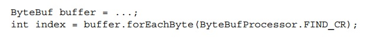

## 第五章   ByteBuf


### 本章包含

    ByteBuf—Netty的数据容器
    API详情
    用例
    内存分配

 

 

 

正如我们前面提到的，网络数据的基础单位总是字节。Java NIO用ByteBuffer做它的字节容器，但是这个类使用起来过于复杂，有时候还非常麻烦。

 

Netty用ByteBuf替代了ByteBuffer，这个强大的实现突破了JDK API的限制，为网络开发者提供了更好的API。

 

在这一章我们会展现同ByteBuffer相比，ByteBuf的出色功能和灵活性。这也让你从大体上更好地理解Netty数据处理的方式，并且为第六章ChannelPipeline和ChannelHandler的讨论做好准备。

 

### 5.1 ByteBuf API

Netty通过两个组件来提供它的数据处理(data handling)服务——抽象类ByteBuf和接口ByteBufHolder。

 

这里是一些ByteBuf API的优点：

    可扩展用户定义的buffer类型
    一个内置的composite buffer类型实现了透明的零拷贝
    根据需求扩展（处理）能力（类似JDK StringBuilder）
    读写模式切换不需要调用ByteBuffer的flip()方法
    读和写采用不同的索引
    支持方法链(method chaining)
    支持引用计数(reference counting)
    支持对象池(Pooling)

 

还有其他一些类用于管理ByteBuf实例的分配，对容器和容器中的数据执行一系列操作。我们会在学习ByteBuf和ByteBufHolder的时候详细研究这些特性。

 

### 5.2 ByteBuf类——Netty的数据容器

因为所有的网络通信都包含了字节序列的运动，所以一个高效易用的数据结构显然是必须的。Netty的ByteBuf满足甚至超越了这些需求。让我们首先来看下ByteBuf是如果用索引来简化数据存取的。

 

#### 5.2.1 如何工作

ByteBuf包含两种不同的索引：一个用于读，另一个用于写。当你从一个ByteBuf读数据的时候，它的readerIndex按读取的字节数量递增。同样地，当你往一个ByteBuf中写数据时，它的writerIndex递增。图5.1 是一个空ByteBuf的布局和状态图。

 

**图5.1 一个16字节的ByteBuf，索引为0**


为了理解这两个索引之间的关系，考虑这么一个情况，当你一直读字节直到readerIndex碰到了writerIndex（即，它们的值相等）时，会发生什么情况。在那时，你已经到达了可读数据的尾部。试图继续读数据会触发一个IndexOutOfBoundException，就像当你试图存取一个数组尾部之外的数据时一样。

 

ByteBuf类中以read或者write开头的方法会增加其相应的索引值，而以set或者get开头的操作则不会。后者这些方法（以set或者get开头）在一个相对索引值(a relative value)上操作，这个相对索引值是作为输入参数被传入这些方法的。

 

一个ByteBuf的最大容量可以被指定，并且试图将写索引移出这个容量值的范围会触发一个异常（默认限制是Integer.MAX_VALUE）。

 

#### 5.2.2 ByteBuf使用模式

用Netty的时候，你会发现一些ByteBuf常见的使用模式。在我们进一步了解它们的过程中，把图5.1——一个用不同索引控制读写的字节数组——牢记在脑子里会很有帮助。

 

**堆内存字节缓冲区(HEAP BUFFERS)**

最常用的ByteBuf模式把数据存储在JVM的堆空间。这个模式被称为字节数组(backing array)，在不用对象池的情况下，提供快速分配和再分配（的功能）。如5.1所示，这个方式非常适合你处理遗留数据(legacy data)。

 

**代码清单5.1 后备数组**


注意：如果hasArray()返回false，试图存取一个字节数组（比如调用array()方法）会触发UnsupportedOperationException。这个模式（HEAP BUFFERS）和JDK的ByteBuffer使用类似。

 

**直接内存字节缓冲区(DIRECT BUFFERS)**

Direct buffer是另一种ByteBuf的模式。我们总是期望分配给对象创建的内存来自堆，但其实不一定是——ByteBuffer类和NIO一起在1.4版本被引入JDK，允许JVM的实现通过本地调用(native calls)来分配内存。这是为了避免在每个本地I/O操作的调用之前（或者之后）拷贝buffer的内容到一个intermediate buffer（或者从intermediate buffer拷贝到buffer）

 

ByteBuffer的Javadoc说的很明确，“direct buffer的内容会位于常规（可被）垃圾收集的堆之外”。这解释了为什么direct buffer很适合用于网络数据传输。如果你的数据放在一个堆分配的buffer里，在被送往socket发送之前，JVM实际上在内部会拷贝你的heap buffer到一个direct buffer。

 

Direct buffer主要的缺点是它们分配和释放的开销比heap buffer更大。如果你用的是遗留代码，你可能还会碰上另一个问题：因为数据不在堆上，你不得不做一次拷贝，如下所示。

 

**代码清单5.2 Direct buffer数据存取**


显然，这比用一个字节数组更费事，所以，如果你事先知道容器里的数据会通过一个数组存取，你也许会更倾向于用堆内存。

 

**复合字节缓冲区(COMPOSITE BUFFERS)**

第三种也是最后一种模式采用composite buffer，是多个ByteBuf实例的统一视图(an aggregated view of multiple ByteBufs)。用这个模式，你可以按需增加或者删除ByteBuf实例，这是JDK ByteBuffer完全没有的一个特性。

 

Netty用ByteBuf的子类CompositeByteBuf实现了这种模式，把多个buffer以一个单独的，融合的buffer的形式展现出来。

 

警告：一个CompositeByteBuf中的ByteBuf实例可能同时包含direct和非direct分配，如果只有一个ByteBuf实例，那么在CompositeByteBuf上调用hasArray()会返回那个ByteBuf的hasArray()值；否则，会返回false。

 

为了说明composite buffer的用法，我们假设有一条通过HTTP传输的消息，包含header和body两部分。这两部分由不同的应用程序模块生成，在消息被发送时被合并到一起。应用程序可以选择为多条消息采用同一个body。这种情况下，应用程序会为每条消息创建一个新的header。

 

因为我们不想为每条消息都分配两个buffer，用CompositeByteBuf最适合不过。它在采用通用ByteBuf API的同时，省掉了不必要的拷贝。图5.2 是最后产生的消息布局。

 

**图5.2 CompositeByteBuf存放一个header和一个body**


下面这段代码说明了用JDK的ByteBuffer是如何实现这个需求的。一个包含两个ByteBuffer的数组被创建用存放消息的header和body，第三个ByteBuffer用来存放所有数据的一份拷贝。

 

**代码清单5.3 用ByteBuffer实现Composite buffer模式**


分配和拷贝操作，还有数组管理，让这个版本的实现看起来低效和别扭。下面这段代码用CompositeByteBuf实现。

 

**代码清单5.4 用CompositeByteBuf实现Composite buffer模式**


CompositeByteBuf可能不允许从一个字节数组获取数据，那么从一个CompositeByteBuf获取数据就类似direct buffer模式，如下所示。

 

**代码清单5.5 从一个CompositeByteBuf存取数据**


注意，Netty优化了使用CompositeByteBuf的socket I/O操作，消除了所有可能的JDK buffer性能和内存使用的代价。这个优化在Netty的内部核心代码，所以没有通过API暴露出来，但是你应该意识到这个优化的效果。


COMPOSITEBYTEBUF API 除了继承自ByteBuf的方法以外，CompositeByteBuf还提供了大量额外的功能。请参考Netty Javadoc来获取完整的API清单。

 

### 5.3 字节级操作

ByteBuf提供了很多基本的读写操作之外的方法来修改它的数据。在下面几个小节我们会讨论其中最重要的几个方法。

 

#### 5.3.1 随机数据获取索引

和一个普通的Java字节数组一样，ByteBuf 索引是从0开始的：第一个字节的索引是0，最后一个总是capacity()-1。从下面这段代码可以看到，存储机制的封装，让迭代(iterate)一个ByteBuf的内容变得非常简单。

 

**代码清单5.6 获取数据**


注意，获取数据采用的方法用一个索引作为一个输入参数，并不改变readerIndex或者writerIndex的值。如果需要，它们的值可以通过调用readerIndex(index)或者writerIndex(index)手动修改。

 

#### 5.3.2 连续数据获取索引

ByteBuf同时有读和写的索引，但是JDK的ByteBuffer只有一个，所以你得调用flip()方法在读写模式之间做切换。从图5.3可见，一个ByteBuf被它的两个索引分成了三个区域。

 

**图5.3 ByteBuf内部划分**


#### 5.3.3 可丢弃字节(discardable bytes)

图5.3中标记为discardable 字节的分段包含已经被读取的字节。通过调用discardReadBytes()，这部分字节可以被丢弃，同时这部分空间被回收。这个分段的初始大小是0，存在readerIndex中，并且随着读操作的执行而增加（get操作不移动readerIndex）。

 

图5.4是在图5.3中的buffer上调用discardReadBytes()的结果。你可以看到，discardable字节分段的空间现在已经可被写了。注意，discardReadBytes()被调用之后，不能保证writable分段的内容（是已经被丢弃的那些字节）

 

**图5.4 丢弃已读字节之后的ByteBuf**

 

虽然你可能忍不住经常要去调用discardReadBytes()来最大化writable分段，请注意这样做很有可能造成内存拷贝，因为readable字节（图中标为CONTENT的部分）要被移动到buffer的头部。我们建议只在真正需要的时候才调用discardReadBytes()；比如，当内存是稀缺品时。

 

#### 5.3.4 可读字节(readable bytes)

ByteBuf的readable字节分段存储真正的数据，一个新分配的，重新包装的(wrapped)，或者刚拷贝的buffer的readerIndex默认值是0。任何以read或者skip开头的方法会按当前readerIndex值读取或者跳过数据，然后按读取的字节数增加readerIndex的值。

 

如果其中某个调用方法的输入参数中包括一个目标ByteBuf做为写入对象，而且输入参数没有目标索引(a destination index)，那么这个目标buffer的writerIndex也会增加（因为写入了这个目标buffer）；例如，

 
```
readBytes(ByteBuf dest);
```
 

当试图从一个没有readable字节的buffer从读取数据，IndexOutOfBoundsException抛出。

 

这段代码说明了如何读所有的readable字节。

 

**代码清单5.7 读所有的数据**


#### 5.3.5 可写字节(writable bytes)

writable字节分段是一块包含未定义内容，待写入的内存。一个新分配的buffer的writerIndex默认值是0。任何以write开头的操作方法会从当前的writerIndex开始写数据，按写入字节的数量来增加writerIndex的值。如果写操作的源也是一个ByteBuf，并且源buffer的索引没有指定，那么源buffer的readerIndex增加同样的值。这个调用看起来像这样：

 
```
writeBytes(ByteBuf dest);
```
 

当向一个目标buffer写数据，并且超出它的容量时，IndexOutOfBoundsException抛出。

 

下面这段代码是一个用随机整数填满一个buffer直到空间用完的例子。writable()方法被用来判断buffer中是否还有足够的空间。

 

**代码清单5.8 写数据**


#### 5.3.6 索引管理

JDK的InputStream定义了方法mark(int readlimit) 和reset()。这两个方法分别用来标记stream的当前位置为一个指定值，或重置当前stream到这个指定位置。

 

同样地，你可以通过调用markReaderIndex()，markWriterIndex(), resetReaderIndex()和resetWriterIndex()设置和重置ByteBuf readerIndex和writerIndex。这些方法和InputStream的类似，除了它们没有readlimit参数来指定何时标记会失效。

 

你也可以通过readerIndex(int)或者writerIndex(int)移动索引到指定位置。试图设置一个索引到一个无效的位置会导致IndexOutOfBoundException。

 

你可以通过调用clear()同时将readerIndex和writerIndex置为0。注意这不会清掉内存里的东西。图5.5（和图5.3一样）说明了clear()是如何工作的。

 

**图5.5 调用clear()之前**


跟之前看到的一样，ByteBuf包括三个分段。图5.6是clear()调用之后的ByteBuf。

 

**图5.6 调用clear()之后**


调用clear()比discardReadBytes()开销小得多，因为它只是重置了索引，没有拷贝任何内存。

 

#### 5.3.7 索引操作

有好几种方法可以获得ByteBuf中某个值的索引。最简单的用法是indexOf()方法。更多复杂的搜索操作可以通过执行那些用ByteBufProcessor做为输入参数的方法实现。ByteBufProcessor这个接口就定义了一个方法，

 
```
boolean process(byte value);
```
 

 

这个方法用来报告是否这个输入值正在被搜索过程中。

 

ByteBufProcessor针对常见的搜索值定义了很多便捷的方法。假设你的应用需要和所谓的Flash sockets整合，这类socket包含NULL结尾的内容。调用buffer的

 
```
forEachByte(ByteBufProcessor.FIND_NUL)
```
 

能更加简单有效地处理Flash数据，因为在处理过程中，执行的边界检查更少了。

 

下面的代码是一个搜索回车字符(\r)的例子。

 

**代码清单5.9 用ByteBufProcessor来寻找\r**


#### 5.3.8 派生的buffer

一个派生的buffer将ByteBuf的内容以一种特定的方式呈现。

    duplicate()
    slice()
    slice(int, int)
    Unpooled.unmodifiableBuffer(…)
    order(ByteOrder)
    readSlice(int)


每个方法都返回一个新的ByteBuf实例，包含该实例自己的reader，writer和标记索引。和JDK ByteBuffer一样，内部的存储是和源ByteBuf共享的。这让派生buffer的创建开销不是不大，但是也意味着如果你改变了派生buffer的内容，你同时也在改变源buffer实例(source instance)的内容，所以使用时要小心。

 

**BYTEBUF COPYING**

如果你需要的是一个现存buffer的拷贝，那么用copy()或者copy(int, int)。和一个派生的buffer不同，这些调用返回的ByteBuf有一份独立（包含独立的内容和索引）的数据拷贝。

 

下面的代码说明了如何用slice(int, int)来操作子ByteBuf(slice)

 

**代码清单5.10 分割一个ByteBuf**


 

现在我们来看下一个ByteBuf的分段(segment)拷贝和子段有什么不同。

 

**代码清单5.11 拷贝一个ByteBuf**

 

两种用法是类似的，除了改变原始ByteBuf的一个子段或者一个拷贝的效果是不同的。只要有可能，尽量用slice()来避免拷贝内存的开销。

 

#### 5.3.9 读/写 操作

像我们提到过的，有两类读/写操作：

    get() 和set() 操作从一个指定的索引开始操作，不改变索引的值
    read()和write操作从一个指定的索引开始操作，随着读/写的字节数调整索引值

 

表5.1 列出了最常用的get()方法。参考API文档获取完整的列表。

 

**表5.1 get()操作**

| 方法名称 | 描述 |
| ---------- | --------- |
| getBoolean(int) | 返回指定索引位置的boolean值 |
| getByte(int) | 返回指定索引位置的byte值 |
| getUnsignedByte(int) |返回指定索引位置的无符号byte值（返回类型是short）|
| getMedium(int) | 返回指定索引位置的24位(medium)值 |
| getUnsignedMedium(int) | 返回指定索引位置的无符号24位(medium)值
| getInt(int) | 返回指定索引位置的int值 |
| getUnsignedInt(int) | 返回指定索引位置的无符号int值（返回类型是long） |
| getLong(int) | 返回指定索引位置的long值
| getShort(int) | 返回指定索引位置的short值 |
| getUnsignedShort(int) | 返回指定索引位置的无符号short值（返回类型是int）|
| getBytes(int, …) | 传送buffer数据到指定索引位置开始的目标位置 |
 
这些操作基本上都有一个对应的set()方法。这些方法列在表5.2

 

**表5.2 set()操作**

| 方法名称 | 描述 |
| ---------- | --------- |
| setBoolean(int, boolean) | 在指定索引位置设置boolean值 |
| setByte(int index, int value) | 在指定索引位置设置Byte值 |
| setMedium(int index, int value) | 在指定索引位置设置24位(medium)值 |
| setInt(int index, int value) | 在指定索引位置设置int值 |
| setLong(int index, long value) | 在指定索引位置设置long值 |
| setShort(int index, int value) | 在指定索引位置设置short值 |

下面的代码是get()和set()方法的用法，可以看到它们并不改变读和写的索引。

 
**代码清单5.12 get()和set()的用法**


 
现在让我们来看下read()操作，它作用于当前的readerIndex或者writeIndex。这些read()方法像读取stream一样从ByteBuf读数据。 表5.3列出了最常用的方法。

 

**表5.3 read()操作**

| 方法名称 | 描述 |
| ---------- | --------- |
| readBoolean() | 返回当前readerIndex位置的boolean值, 然后readerIndex加1 |
| readByte() | 返回当前readerIndex位置的byte值, 然后readerIndex加1 |
| readUnsignedByte() | 返回当前readerIndex位置的无符号byte值（返回类型是short）, 然后readerIndex加1 |
| readMedium() | 返回当前readerIndex位置的24位(medium)值, 然后readerIndex加3 |
| readUnsignedMedium() | 返回当前readerIndex位置的无符号24位(medium)值, 然后readerIndex加3 |
| readInt() | 返回当前readerIndex位置的int值, 然后readerIndex加4 |
| readUnsignedInt() | 返回当前readerIndex位置的无符号int值（返回类型是long）, 然后readerIndex加4 |
| readLong() | 返回当前readerIndex位置的long值, 然后readerIndex加8 |
| readShort() | 返回当前readerIndex位置的short值, 然后readerIndex加2 |
| readUnsignedShort() | 返回当前readerIndex位置的无符号short值（返回类型是int）, 然后readerIndex加2 |
| readBytes(ByteBuf | byte[] destination, int dstIndex [,int length]) |  从readerIndex位置（如果有指定，长度是length字节）开始，传送当前ByteBuf数据到目标ByteBuf或者byte[]。当前ByteBuf的readerIndex值根据已传送的字节数增长 |


几乎每一个read()方法都有一个对应的write()方法，用来往一个ByteBuf添加数据。注意，列在表5.4中的这些方法的输入参数，都是待写入ByteBuf的值，而不是索引值。

 

**表5.4  write()操作**

| 方法名称 | 描述 |
| ---------- | --------- |
| writeBoolean(boolean) | 在当前writerIndex位置写入boolean值，然后writerIndex加1 |
| writeByte(int) | 在当前writerIndex位置写入byte值，然后writerIndex加1 |
| writeMedium(int) | 在当前writerIndex位置写入medium值，然后writerIndex加3 |
| writeInt(int) | 在当前writerIndex位置写入int值，然后writerIndex加4 |
| writeLong(long) | 在当前writerIndex位置写入long值，然后writerIndex加8 |
| writeShort(int) | 在当前writerIndex位置写入short值，然后writerIndex加2 |
| writeBytes(source ByteBuf \| byte[] int srcIndex,int length]) | 从当前writerIndex位置开始，从指定的源ByteBuf或者byte[]传送数据到当前ByteBuf。如果输入参数中提供了srcIndex和length，那么从srcIndex开始读出length长的字节。当前ByteBuf的writerIndex值根据已写入的字节数增长 |


代码5.13是这些方法的示例。

**代码清单5.13 ByteBuf上的read()和write()操作**


### 5.3.10 更多操作

表5.5列出了ByteBuf提供的其他一些有用的操作方法。

 
**表5.5 其他有用的操作**

| 方法名称 | 描述 |
| ---------- | --------- |
| isReadable() | 如果至少一字节大小的数据可读，返回true |
| isWritable() | 如果至少一字节大小的数据可写，返回true |
| readableBytes() | 返回可读的字节数 |
| writableBytes() | 返回可写的字节数 |
| capacity() | 返回ByteBuf可容纳的字节数。调用该方法后，ByteBuf会试着扩展容量直到到达maxCapacity() |
| maxCapacity() | 返回ByteBuf可容纳的最大字节数 |
| hasArray() | 如果ByteBuf有一个字节数组，返回true |
| Array() | 如果ByteBuf有一个字节数组，返回该数组；否则，抛出异常UnsupportedOperationException |

 

### 5.4 ByteBufHolder接口

我们经常会发现，除了数据负载，我们还需要存储各种数据属性。一个HTTP响应就是一个很好的例子；除了以字节形式展现的消息体(content)，还有状态码(status code)， cookie等等。

 

Netty提供了ByteBufHolder来应对这样一种常见的情况。ByteBufHolder还为Netty的一些高级特性提供了支持，比如buffer池，一个ByteBuf可用从一个池中取出，然后在需要时被自动释放（回池中）。

 

ByteBufHolder只有一些少量的方法用来获取底层数据和引用计数。表5.6列出了这些方法（没有列出从ReferenceCounted继承的方法）。

 
**表5.6  ByteBufHolder操作**

| 方法名称 | 描述 |
| ---------- | --------- |
| content() | 返回ByteBufHolder的ByteBuff数据 |
| copy() | 返回ByteBufHolder的深拷贝(deep copy)， 包括一份和源ByteBuf数据独立的(unshared)拷贝 |
| duplicate() | 返回ByteBufHolder的浅拷贝(shallow copy)，包括一份和源ByteBuf数据共享的(shared)拷贝 |
 

如果你想实现一个消息对象，把消息负载(payload)存储在一个ByteBuf中，那么ByteBufHolder是个不错的选择。

 

### 5.5 ByteBuf分配

在这一节我们会说明管理ByteBuf实例的几种方法。

 

#### 5.5.1 按需分配：接口ByteBufAllocator

为了减少分配和释放内存的开销，Netty用接口ByteBufAllocator实现了对象池，可以用来分配我们提到过的所有模式的ByteBuf实例。对象池的使用和具体应用有关，并不影响ByteBuf API的用法。

 

表5.7列出了ByteBufAllocator的一些操作

 

**表5.7 ByteBufAllocator方法**

| 方法名称 | 描述 |
| ---------- | --------- |
| buffer()<br>buffer(int initialCapacity)<br>buffer(int initialCapacity, int maxCapacity) | 返回heap或者direct ByteBuf |
| heapBuffer()<br>heapBuffer(int initialCapacity)<br>heapBuffer(int initialCapacity, int maxCapacity)| 返回heap ByteBuf |
| directBuffer()<br>directBuffer(int initialCapacity)<br>directBuffer(int initialCapacity, int maxCapacity) |  返回direct ByteBuf |
| compositeBuffer()<br>compositeBuffer(int maxNumComponents)<br>compositeDirectBuffer()<br>compositeDirectBuffer(int maxNumComponents)<br>compositeHeapBuffer()<br>compositeHeapBuffer(int maxNumComponents) | 返回CoompositeByteBuf，可以根据指定的component数量来扩展heap或者direct buffer |
| ioBuffer() | 返回一个用于socket I/O操作的ByteBuf |

你可以从一个Channel（每个Channel实例都不同）或者从ChannelHandler绑定的ChannelHandlerContext中获取

ByteBufAllocator的一个引用。下面的代码说明了这两种方法。

 

**代码清单5.14 获取一个ByteBufAllocator引用**


Netty提供了ByteBufAllocator的两种实现：PoolByteBufAllocator和UnpooledByteBufAllocator。前者将ByteBuf实例放入池中，提高了性能，将内存碎片减少到最小。这个实现采用了一种内存分配的高效策略，称为jemalloc。它已经被好几种现代操作系统所采用。后者则没有把ByteBuf放入池中，每次被调用时，返回一个新的ByteBuf实例。


虽然Netty默认使用PoolByteBufAllocator，但是改变默认设置很简单，只要通过ChannelConfig API或者在Bootstrap应用程序的时候指定一个不同的allocator就可以了。更多详情可以参考第八章。

 

#### 5.5.2 Unpooled buffers

有些时候，你不能获取到ByteBufAllocator的引用。在这种情况下，Netty有一个被称为Unpooled的工具类，提供了一些静态的辅助方法(helper methods)来创建unpooled ByteBuf实例。表5.8列出了其中最重要的几个方法。

 

**表5.8 Unpooled方法**

| 方法名称 | 描述 |
| ---------- | --------- |
| buffer()<br>buffer(int initialCapacity)<br>buffer(int initialCapacity, int maxCapacity) | 返回heap ByteBuf |
| directBuffer()<br>directBuffer(int initialCapacity)<br>directBuffer(int initialCapacity, int maxCapacity) | 返回direct ByteBuf | wrappedBuffer() | 返回 wrapped ByteBuf |
| copiedBuffer() | 返回copied ByteBuf |

Unpooled类让ByteBuf也同样适用于不需要其他的Netty组件的、无网络操作的项目，这些项目可以从这个高性能的、可扩展的buffer API中获益。

 

#### 5.5.3 类ByteBufUtil

ByteBufUtil提供了一些操作ByteBuf的静态辅助方法。因为这个ByteBufUtil API是通用的，并且和内存池并无关联，所以这些辅助方法是在buffer类之外实现的（译者注：从ByteBufUtil Javadoc可见，它是继承自Object的）。

 

这些静态方法中最有价值的也许就是hexdump(), 它将一个ByteBuf内容以十六进制字符串的方式打印出来。这在各种情况下都很有用，比如为了调试，记录ByteBuf的内容。一个以十六进制表示的记录日志通常比直接用字节表示的更有用。此外，十六进制表示的版本很容易转换回原字节表示的形式。

 

另一个有用的方法是boolean equals(ByteBuf, ByteBuf)，用来判断两个ByteBuf实例是否相等。如果你实现了你自己的ByteBuf子类，你也许还能发现一些其他有用的ByteBufUtil方法。

 

### 5.6 引用计数(Reference counting)

引用计数是一项通过释放不再被其他对象引用的对象的资源，来优化内存使用和性能的技术。Netty在第四版为ByteBuf和ByteBufHolderf引入了引用计数，它们都实现了ReferenceCounted接口。

 

引用计数背后的思想不是特别复杂；它主要参与追踪某个特定对象活跃的引用数量。一个ReferenceCounted实现的实例通常从1开始计数。只要引用计数大于0，这个对象就保证不会被释放。当活跃的引用计数减少到0，对象就会被释放。注意，虽然释放的确切含义根据具体实现有所不同，但最起码，一个已经被释放的对象不能再被使用。

 

引用计数对对象池的实现很关键，比如让PoolByteBufAllocator减小了内存分配的开销。示例在下面两段代码里。

 

**代码清单5.15 引用计数**


**代码清单5.16 释放包含引用计数的对象**


如果包含引用计数的对象已经被释放，当试图获取这个对象时会抛出引用越界的异常IllegalReferenceCountException。

 

要注意的是，某个类可以定义它独有的释放-计数规则。比如说，我们可以想象有这么一个类，不管当前值是多少，它的release()方法总是把引用计数器设为0，因此可以即刻让所有活跃的引用失效。

 

*谁来负责释放？*

通常来说，最后一次获取对象的代码应该负责释放它。在第六章，我们会解释这个概念和ChannelHandler以及ChannelPipeline之间的关联。

 

### 5.7 小结

这一章致力于介绍基于ByteBuf的Netty数据容器。我们首先解释了ByteBuf相比JDK ByteBuffer的一些优势。我们还强调了几种不同模式的API，并指出了它们最适合哪些使用场景。


下面是我们提到过的本章要点：

- 读写分离的索引用来控制数据存取
- 不同的内存管理策略——字节数组和direct buffer
- 代表了多个ByteBuf统一视图的composite buffer
- 数据存取的方法：搜索，分割，和拷贝
- read，write，get和set APIs
- ByteBufAllocator对象池和引用计数

在下一章，我们会把重点放在为你的数据处理逻辑提供了传输媒介的ChannelHandler。因为ChannelHandler大量使用了ByteBuf，你会看到整个Netty结构的这些重要部分将会聚集到一起。
