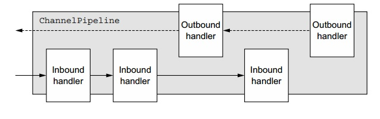

## 第六章   ChannelHandler和ChannelPipeline


### 本章包含

    ChannelHandler和ChannelPipeline APIs
    检测资源泄露
    异常处理

 

在前一章，你学习了Netty的数据容器ByteBuf。在这一章我们会在你已经学过的知识的基础上探讨Netty的数据流和处理模块。你会开始看到这个框架的一些重要元素被组合到一起了。
 

你已经了解到，ChannelHandler在一个ChannelPipeline中被链在一起，将所有的处理逻辑组织起来。我们会在这一章学习有关这两个类的各种用例，以及另一个重要的相关类，ChannelHandlerContext。

 

理解所有这些组件之间的相互作用是用Netty创建一个模块化的，可复用应用的关键。

 

### 6.1 ChannelHandler家族

为了给ChannelHandler的深入学习做好准备，我们先花一些时间来巩固下Netty的组件模型。

 

#### 6.1.1 Channel的生命周期

接口Channel定义了一个简单强大，并且和ChannelInboundHandler API密切相关的状态模型。四种Channel状态如表6.1所示。

 

**表6.1 Channel生命周期状态**

| 状态 | 描述 |
| -------- | --------- |
| ChannelUnregistered | Channel已创建，还未注册到一个EventLoop上 |
| ChannelRegistered | Channel已经注册到一个EventLoop上 |
| ChannelActive | Channel是活跃状态（连接到某个远端），可以收发数据 |
| ChannelInactive | Channel未连接到远端 |

一个Channel正常的生命周期如图6.1所示。随着状态发生变化，相应的event产生。这些event被转发到ChannelPipeline中的ChannelHandler来采取相应的操作。

 

**图6.1 Channel状态模型**


#### 6.1.2 ChannelHandler的生命周期

接口ChannelHandler定义的生命周期相关的操作列在表6.2。这些操作在ChannelHandler被添加到一个ChannelPipeline，或者从一个ChannelPipeline中移除时被调用。这里的每个方法都包含一个ChannelHandlerContext做为输入参数。

 

**表6.2 ChannelHandler生命周期方法**

| 类型 | 描述 |
| -------- | --------- |
| handlerAdded | 当ChannelHandler被添加到一个ChannelPipeline时被调用 |
| handlerRemoved | 当ChannelHandler从一个ChannelPipeline中移除时被调用 |
| exceptionCaught | 处理过程中ChannelPipeline中发生错误时被调用 |
 
Netty定义了下面两个重要的ChannelHandler子接口
- ChannelInboundHandler——处理输入数据和所有类型的状态变化
- ChannelOutboundHandler——处理输出数据，可以拦截所有操作

 
在下面的小节里，我们会详细讨论这两个接口。

 

#### 6.1.3 ChannelInboundHandler接口

表6.3列出了接口ChannelInboundHandler生命周期相关的方法。当收到数据，或者相关Channel的状态改变时，这些方法被调用。像我们之前提到的，这些方法和Channel的生命周期密切相关。


**表6.3 ChannelInboundHandler方法**

| 类型 | 描述 |
| -------- | --------- |
| channelRegistered | 当一个Channel注册到EventLoop上，可以处理I/O时被调用 |
| channelUnregistered | 当一个Channel从它的EventLoop上解除注册，不再处理I/O时被调用 |
| channelActive |当Channel变成活跃状态时被调用；Channel是连接/绑定、就绪的 |
| channelInactive | 当Channel离开活跃状态，不再连接到某个远端时被调用 |
| channelReadComplete | 当Channel上的某个读操作完成时被调用 |
| channelRead | 当从Channel中读数据时被调用 |
| channelWritabilityChanged | 当Channel的可写状态改变时被调用。通过这个方法，用户可以确保写操作不会进行地太快（避免OutOfMemoryError）或者当Channel又变成可写时继续写操作。Channel类的isWritable()方法可以用来检查Channel的可写状态。可写性的阈值可以通过 
Channel.config().setWriteHighWaterMark()和Channel.config().setWriteLowWaterMark()来设定。|
| userEventTriggered | 因某个POJO穿过ChannelPipeline引发ChannelnboundHandler.fireUserEventTriggered()时被调用 |
 

当一个ChannelInboundHandler实现类重写channelRead()方法时，它要负责释放ByteBuf相关的内存。Netty为此提供了一个工具方法，ReferenceCountUtil.release()，如下所示。

 

**代码清单6.1 释放消息资源**


对未释放的资源，Netty会打印一个警告级别(WARN-level)的日志消息，让你很方便地找到代码中出问题的实例。但是用这种方式管理资源有些麻烦。一个更简单的替代方法就是用SimpleChannelInboundHandler。下面的代码是6.1的另一种形式，说明了SimpleChannelInboundHandler的用法。


**代码清单6.2 使用SimpleChannelInboundHandler**


因为SimpleChannelInboundHandler自动释放资源，任何对消息的引用都会变成无效，所以你不能保存这些引用待后来使用.

 

6.1.6小节有一个关于引用处理更详细的讨论。

 

#### 6.1.4 ChannelOutboundHandler接口

输出的操作和数据由ChannelOutBoundHandler处理。它的方法可以被Channel，ChannelPipeline和ChannelHandlerContext调用。

 

ChannelOutboundHandler有一个强大的功能，可以按需推迟一个操作，这使得处理请求可以用到更为复杂的策略。比如，如果写数据到远端被暂停，你可以推迟flush操作，稍后再试。

 

表6.4列出了所有ChannelOutboundHandler自己定义的方法（省掉了那些继承自ChannelHandler的方法）。

 

**表6.4 ChannelOutboundHandler方法**

| 类型 | 描述 |
| -------- | --------- |
| bind(ChannelHandlerContext,SocketAddress,ChannelPromise) | 请求绑定Channel到一个本地地址 |
| connect(ChannelHandlerContext, SocketAddress,SocketAddress,ChannelPromise) | 请求连接Channel到远端 |
| disconnect(ChannelHandlerContext, ChannelPromise) | 请求从远端断开Channel |
| close(ChannelHandlerContext,ChannelPromise) | 请求关闭Channel |
| deregister(ChannelHandlerContext, ChannelPromise) | 请求Channel从它的EventLoop上解除注册 |
| read(ChannelHandlerContext) | 请求从Channel中读更多的数据 |
| flush(ChannelHandlerContext) | 请求通过Channel刷队列数据到远端 |
| write(ChannelHandlerContext,Object, ChannelPromise) | 请求通过Channel写数据到远端 |
 

**CHANNELPROMISE VS. CHANNELFUTURE**

ChannelOutboundHandler的大部分方法都用了一个ChannelPromise输入参数，用于当操作完成时收到通知。ChannelPromise是ChannelFuture的子接口，定义了可写的方法，比如setSuccess()，或者setFailure()，而ChannelFuture则是不可变对象。

 

接下来，让我们来看下那些让编写定制化ChannelHandler变得更容易的适配器类

 

#### 6.1.5 ChannelHandler适配器类

刚开始尝试些写你自己的ChannelHandler时，你可以用ChannelInboundHandlerAdapter和ChannelOutboundHandlerAdapter这两个类。这两个适配器类分别提供了ChannelInboundHandler和ChannelOutboundHandler的基本实现。它们继承了共同的父接口ChannelHandler的方法，扩展了抽象类ChannelHandlerAdapter。类层级关系如图6.2所示。

 

**图6.2 ChannelHandlerAdapter类层级关系**


ChannelHandlerAdapter还提供了一个工具方法isSharable()。如果类实现带@Sharable注解，那么这个方法就会返回true，意味着这个对象可以被添加到多个ChannelPipeline中（如2.3.1小节所述）。

 

ChannelInboundHandlerAdapter和ChannelOutboundHandlerAdapter中的方法调用相关ChannelHandlerContext中的等效方法，因此将事件转发到管道中的下一个ChannelHandler。

 

如果想在你自己的handler中用到这些适配器类，只需要扩展它们，重写那些你想要定制的方法。

 

#### 6.1.6 资源管理

无论何时你对数据操作ChannelInboundHandler.channelRead()或者ChannelOutboundHandler.write()，你需要确保没有资源泄露。也许你还记得上一章我们提到过，Netty采用引用计数来处理ByteBuf池。所以，在你用完一个ByteBuf后，调整引用计数的值是很重要的。

 

为了帮助你诊断潜在的问题，Netty提供了ResourceLeakDetector类，它通过采样应用程序1%的buffer分配来检查是否有内存泄露。这个过程的开销是很小的。

 

如果泄露被检测到，会产生类似下面这样的日志消息：
```
LEAK: ByteBuf.release() was not called before it's garbage-collected. Enable

advanced leak reporting to find out where the leak occurred. To enable

advanced leak reporting, specify the JVM option

'-Dio.netty.leakDetectionLevel=ADVANCED' or call

ResourceLeakDetector.setLevel().
```
 

 

Netty目前定义了四种内存泄露检测的级别，如表6.5所示。

**表6.5 内存泄露检测级别**

| 级别 | 描述 |
| ------------ | ---------- |
| DISABLED | 关闭内存泄露检测。 只有在大量测试后，才能用这个级别 |
| SIMPLE | 报告默认的1%采样率中发现的任何泄露。这是默认的级别，在大部分情况下适用 |
| ADVANCED | 报告发现的泄露和消息的位置。使用默认的采样率。|
| PARANOID | 类似ADVANCED级别，但是每个消息的获取都被检测采样。这对性能有很大影响，只能在调试阶段使用。|

用上表中的某个值来配置下面这个Java系统属性，就可以设定内存泄露检测级别：

 
```
java -Dio.netty.leakDetectionLevel=ADVANCED
```
 

如果你设定这个JVM选项然后重启你的应用，你会看到应用中泄露buffer的最新位置。下面是一个单元测试产生的典型的内存泄露报告：
```
Running io.netty.handler.codec.xml.XmlFrameDecoderTest

15:03:36.886 [main] ERROR io.netty.util.ResourceLeakDetector - LEAK:

          ByteBuf.release() was not called before it's garbage-collected.

Recent access records: 1

#1: io.netty.buffer.AdvancedLeakAwareByteBuf.toString(

       AdvancedLeakAwareByteBuf.java:697)

io.netty.handler.codec.xml.XmlFrameDecoderTest.testDecodeWithXml(

       XmlFrameDecoderTest.java:157)

io.netty.handler.codec.xml.XmlFrameDecoderTest.testDecodeWithTwoMessages(

       XmlFrameDecoderTest.java:133)

...
```
 

在你实现ChannelInboundHandler.channelRead()或者ChannelOutboundHandler.write()时，你怎样用这个诊断工具来防止内存泄露呢？让我们来看下ChannelRead()操作“消费(consume)”输入数据这个情况：就是说，当前handler没有通过ChannelContext.fireChannelRead()把消息传递到下一个ChannelInboundHandler。下面的代码说明了如何释放这条消息占用的内存。

 

**代码清单6.3 读取和释放输入的消息**


 

因为读取和释放输入消息是一个非常常见的任务，Netty提供了一个特殊的ChannelInboundHandler实现类——SimpleChannelInboundHandler。一条消息在被SimpleChannelInboundHandler的ChannelRead0()读取后，会被自动释放资源。

 

在输出方向，如果你处理一个write()操作并且丢弃一条消息（没有写入Channel），你就应该负责释放这条消息。下面的代码说明了如何实现丢弃所有待写的数据。

 

**代码清单6.4 丢弃和释放输出数据**


重要的是，不仅要释放资源，而且要通知ChannelPromise，否则会出现某个ChannelFutureListener没有被通知到消息已经被处理的情况。

 

总之，如果一个消息被“消费”或者丢弃，没有送到ChannelPipeline中的下一个ChannelOutboundHandler，用户就要负责调用ReferenceCountUtil.release()。如果消息到达了真正的传输层，在它被写到socket中或者Channel关闭时，会被自动释放（这种情况下用户就不用管了）。

 

### 6.2 ChannelPipeline接口

如果你把一个ChannelPipeline看成是一串ChannelHandler实例，拦截穿过Channel的输入输出event，那么就很容易明白这些ChannelHandler的交互是如何构成了一个应用程序数据和事件处理逻辑的核心。

 

每个新创建的Channel都会分配一个新的ChannelPipeline。这个关系是恒定的；Channel不可以换别ChannelPipeline，也不可以解除掉当前分配的ChannelPipeline。在Netty组件的整个生命周期中这个关系是固定的，不需要开发者采取什么操作。

 

根据来源，一个event可以被一个ChannelInboundHandler或者ChannelOutboundHandler处理。接下来，通过调用ChannelHandlerContext的方法，它会被转发到下一个同类型的handler。

 

**ChannelHandlerContext**

ChannelHandlerContext让一个ChannelHandler可以和它的ChannelPipeline和其他handler的交互。通过ChannelHandlerContext，一个handler可以通知ChannelPipeline中的下一个ChannelHandler，甚至动态改动它所属的ChannelPipeline。

 

ChannelHandlerContext有大量丰富的API来处理event和进行I/O操作。6.3小节会提供更多关于ChannelHandlerContext的信息。

 

图6.3是一个典型的ChannelPipeline布局，包括输入和输出ChannelHandler；同时说明了我们之前提到过的：ChannelPipeline主要就是由一系列的ChannelHandler组成的。ChannelPipeline也提供了在ChannelPipeline中传送event的方法。如果一个输入event被触发，它会从ChannelPipeline的头部被送到尾部。在图6.3， 一个输出I/O event会从ChannelPipeline的最右边一直走到最左边。

 

**图6.3 ChannelPipeline and ChannelHandlers**


 

**有关ChannelPipeline**

你也许会说，从event穿过ChannelPipeline这个角度看，起始端取决于这个event是输入还是输出的。但是Netty总是把ChannelPipeline的输入入口（图6.3的最左边）作为起点，输出入口（最右边）作为终点。

当你用ChannelPipeline.add*()方法把混合的输入和输出handler添加进一个ChannelPipeline后，每个ChannelHandler的序号就是它在ChannelPipeline中从头至尾的位置。因此，如果你为图6.3中的handler从左到右遍序号，第一个被输入event碰到的ChannelHandler序号是1,；第一个被输出event碰上的ChannelHandler序号是5。

 

随着ChannelPipeline传送一个event，它会判断pipeline中的下一个ChannelHandler的类型是否符合event的走向。如果不符合，那么ChannelPipeline会跳过这个ChannelHandler，前进到下一个，直到它碰到符合event走向的ChannelHandler。（当然，一个handler可以同时实现ChannelInboundHandler和ChannelOutBoundHandler接口。）

 

#### 6.2.1 修改一个ChannelPipeline

一个ChannelHandler可以通过增加，删除或者替换其他ChannelHandler来改变一个ChannelPipeline的布局。（它也可以把自己从ChannelPipeline中删掉。）这是ChannelHandler最重要的特性之一，所以我们会进一步来看下它是如何实现这个特性的。相关的方法列在表6.6。

 

**表6.6 改动ChannelPipeline的ChannelHandler方法**

| 方法名 | 描述 |
| ---------- | ----------- | 
| addFirst<br>addBefore<br>addAfter<br>addLast | 添加一个ChannelHandler到ChannelPipeline |
| remove | 从ChannelPipeline删除一个ChannelHandler |
| replace | 用一个ChannelHandler替换ChannelPipeline中的另一个ChannelHandler |
 

下面的代码说明了这些方法是如何使用的。

 

**代码清单6.5 修改ChannelPipeline**

后面你会看到，这个重组ChannelHandler的特性可以带来非常灵活的逻辑实现。

 

**ChannelHandler的执行和阻塞**

通常ChannelPipeline中的每个ChannelHandler通过它的EventLoop（I/O线程）来处理传给它的event。不阻塞这个线程是非常重要的，因为阻塞有可能会对整个I/O处理造成负面影响。

 

有时候，我们会需要跟调用了阻塞API的现存代码交互。在这种情况下，ChannelPipeline的一些add()方法支持EventExcutorGroup。如果event被送往一个定制的EventExcutorGroup，它会被这个EventExcutorGroup中的一个EventExecutor处理，由此脱离了Channel的EventLoop。针对这种场景，Netty提供了一个具体实现，称为DefaultEventExecutorGroup。

 

除了表6.6的这些操作，还有一些方法可以通过类型或者名字来获取ChannelHandler。如表6.7所示。

 

**表6.7 ChannelPipeline获取ChannelHandler的操作**

| 方法名 | 描述 |
| get | 通过类型或者名字返回一个ChannelHandler |
| context | 返回ChannelHandler绑定的ChannelHandlerContext |
| names | 返回ChannelPipeline中的所有ChannelHandler的名字 |
 

#### 6.2.2 启动事件

ChannelPipeline API 提供了一些调用输入和输出操作的额外方法。表6.8里列出了输入方法，用来通知ChannelInboundHandler在ChannelPipeline中发生的event。

 

**表6.8 ChannelPipeline输入方法**

| 方法名 | 描述 |
| ----------- | ---------- |
| fireChannelRegistered | 调用ChannelPipeline中下一个ChannelInboundHandler的channelRegistered(ChannelHandlerContext) |
| fireChannelUnregistered | 调用ChannelPipeline中下一个ChannelInboundHandler的channelUnRegistered(ChannelHandlerContext) |
| fireChannelActive | 调用ChannelPipeline中下一个ChannelInboundHandler的channelActive(ChannelHandlerContext) |
| fireChannelInactive | 调用ChannelPipeline中下一个ChannelInboundHandler的channelInactive(ChannelHandlerContext) |
| fireExceptionCaught | 调用ChannelPipeline中下一个ChanneHandler的exceptionCaught(ChannelHandlerContext,Throwable) |
| fireUserEventTriggered | 调用ChannelPipeline中下一个ChannelInboundHandler的userEventTriggered(ChannelHandlerContext, Object) |
| fireChannelRead | 调用ChannelPipeline中下一个ChannelInboundHandler的channelRead(ChannelHandlerContext, Object msg) |
| fireChannelReadComplete | 调用ChannelPipeline中下一个ChannelStateHandler的channelReadComplete(ChannelHandlerContext) |
 
在输出方向，处理一个event会作用于底层的socket。表6.9列出了ChannelPipeline API的输出操作。

 
**表6.9 ChannelPipeline输出操作**

| 方法名 |  描述 |
| ----------- | ---------- |
| bind | 绑定Channel到一个本地地址。这会调用ChannelPipeline中下一个 ChannelOutboundHandler的bind(ChannelHandlerContext, SocketAddress, ChannelPromise) |
| connect | 连接Channel到一个远端地址，这会调用ChannelPipeline中下一个ChannelOutboundHandler的connect(ChannelHandlerContext, SocketAddress, ChannelPromise) |
| disconnect | 断开Channel。这会调用ChannelPipeline中下一个ChannelOutboundHandler的disconnect(ChannelHandlerContext, ChannelPromise) |
| close |  关闭Channel。这会调用ChannelPipeline中下一个ChannelOutboundHandler的 close(ChannelHandlerContext,ChannelPromise) |
| deregister | Channel从它之前分配的EventLoop上解除注册。 这会调用ChannelPipeline中下一个ChannelOutboundHandler的deregister(ChannelHandlerContext, ChannelPromise) |
| flush | 刷所有Channel待写的数据。这会调用ChannelPipeline中下一个ChannelOutboundHandler的flush(ChannelHandlerContext) |
| write | 往Channel写一条消息。这会调用ChannelPipeline中下一个ChannelOutboundHandler的write(ChannelHandlerContext, Object msg, ChannelPromise)<br>注意：不会写消息到底层的Socket，只是排队等候。如果要写到Socket中，调用flush()或者writeAndFlush() |
| writeAndFlush | 这是先后调用write()和flush()的便捷方法。|
| read | 请求从Channel中读更多的数据。这会调用ChannelPipeline中下一个ChannelOutboundHandler的read(ChannelHandlerContext) |
 

小结，
- ChannelPipeline保存了所有Channel相关的ChannelHandler
- 可通过增加和减少ChannelHandler来动态修改ChannelPipeline
- ChannelPipeline有大量API，用来对输入输出event做出响应行动。

 
### 6.3 ChannelHandlerContext接口

ChannelHandlerContext代表了一个ChannelHandler和一个ChannelPipeline之间的关系，它在ChannelHandler被添加到ChannelPipeline时被创建。ChannelHandlerContext的主要功能是管理它对应的ChannelHandler和属于同一个ChannelPipeline的其他ChannelHandler之间的交互。

 

ChannelHandlerContext有很多方法，其中一些方法Channel和ChannelPipeline也有，但是有些区别。如果你在Channel或者ChannelPipeline实例上调用这些方法，它们的调用会穿过整个pipeline。而在ChannelHandlerContext上调用的同样的方法，仅仅从当前ChannelHandler开始，走到pipeline中下一个可以处理这个event的ChannelHandler。

 

表6.10 总结了ChannelHandlerContex API。

 

**表6.10 ChannelHandlerContext API**

| 方法名 | 描述 |
| ----------- | ---------- |
| bind | 绑定到给定的SocketAddress，返回一个ChannelFuture |
| channel | 返回绑定的Channel |
| close | 关闭Channel，返回一个ChannelFuture |
| connect | 连接到给定的SocketAddress，返回一个ChannelFuture |
| deregister | 从先前分配的EventExecutor上解除注册，返回一个ChannelFuture |
| disconnect | 从远端断开，返回一个ChannelFuture |
| executor | 返回分发event的EventExecutor |
| fireChannelActive | 触发调用下一个ChannelInboundHandler的channelActive()（已连接）|
| fireChannelInactive | 触发调用下一个ChannelInboundHandler的channelInactive()（断开连接） |
| fireChannelRead | 触发调用下一个ChannelInboundHandler的channelRead()（收到消息） |
| fireChannelReadComplete | 触发channelWritabilityChanged event到下一个ChannelInboundHandler |
| handler | 返回绑定的ChannelHandler |
| isRemoved | 如果绑定的ChannelHandler已从ChannelPipeline中删除，返回true |
| name | 返回本ChannelHandlerContext 实例唯一的名字 |
| Pipeline | 返回绑定的ChannelPipeline |
| read | 从Channel读数据到第一个输入buffer；如果成功，触发一条channelRead event，通知handler channelReadComplete |
| write | 通过本ChannelHandlerContext写消息穿过pipeline |
 
在使用ChannelHandlerContext API时，请牢记下面几点：

- 一个ChannelHandler绑定的ChannelHandlerContext 永远不会改变，所以把它的引用缓存起来是安全的。
- 像我们在这节刚开始解释过的，ChannelHandlerContext的一些方法和其他类（Channel和ChannelPipeline）的方法名字相似，但是ChannelHandlerContext的方法采用了更短的event传递路程。我们应该尽可能利用这一点来实现最好的性能。

 

#### 6.3.1 使用ChannelHandlerContext

在这一节我们会讨论ChannelHandlerContext的用法，以及ChannelHandlerContext，Channel和ChannelPipeline的方法展现出来的行为。图6.4说明了它们之间的关系。

 

**图6.4  Channel， ChannelPipeline，ChannelHandler和ChannelHandlerContext之间的关系**


在下面的这段代码里，你从ChannelHandlerContext中获取了Channel的引用。在Channel上调用write()会让写event穿过整个pipeline。

 

**代码清单6.6 从ChannelHandlerContext从获取Channel**


下面这段代码是一个类似的例子，但是这次却写数据到一个ChannelPipeline。ChannelPipeline的引用是从ChannelHandlerContext中获取的。

 

**代码清单6.7 从ChannelHandlerContext从获取ChannelPipeline**


你从图6.5可以看到，代码6.7和6.8中的event传递路径是类似的。重点要注意的是，虽然不管是Channel还是ChannelPipeline上调用的write()都是穿过整个pipeline传递event的，但是在ChannelHandler里，从一个handler走到下一个，是通过ChannelHandlerContext的。

 

**图6.5 通过Channel或者ChannelPipeline传递event**


那为什么你可能会需要在ChannelPipeline某个特定的位置开始传送一个event呢？

    减少因为让event穿过那些对它不感兴趣的ChannelHandler而带来的开销
    避免event被那些可能对它感兴趣的handler处理

 

为了从某个特定的ChannelHandler开始处理，你必须获取前一个ChannelHandler绑定的ChannelHandlerContext的引用。这个ChannelHandlerContext会调用它所绑定的ChannelHandler的下一个handler。

 

下面的代码和图6.6说明了这个用法。

 

**代码清单6.8 调用ChannelHandlerContext上的write()**


如图6.6所示，穿过ChannelPipeline的消息从下一个ChannelHandler开始，忽略所有之前的ChannelHandler。

 

**图6.6 ChannelHandlerContext触发的event流操作**


 

我们刚刚描述的这个用例很常见，当被用来在一个特定的ChannelHandler实例上调用一些操作时，这个做法特别有用。

 

### 6.3.2 ChannelHandler和ChannelHandlerContext的高级用法

在代码清单6.6中你已经看到，你可以通过调用ChannelHandlerContext的pipeline方法来获取绑定的ChannelPipeline引用。这实现了对ChannelHandler在运行时的操控，可以实现一些更为复杂的设计。比如，你可以添加一个ChannelHandler到一个pipeline来支持一个动态的协议转换。

 

其他的高级应用还包括把一个ChannelHandlerContext的引用放入缓存，待后来使用。稍后在使用该引用时，可能不在ChannelHandler方法内，甚至可能在另一个线程里。这段代码说明了如何用这种模式来触发一个event。

 

**代码清单6.9 缓存一个ChannelHandlerContext**


因为一个ChannelHandler可以属于多个ChannelPipeline，所以它可以绑定多个ChannelHandlerContext实例。想要实现这个用法的ChannelHandler必须加上注解@Sharable；否则，试图将它添加到多个ChannelPipeline时会触发一个异常。显然，想要在多并发channel（也就是连接）中保证线程安全，这样的一个ChannelHandler必须是线程安全的类。

 

**代码清单6.10 可共享的ChannelHandler**


6.10中的ChannelHandler实现满足放入多个pipeline的条件；也就是说，它加上了@Sharable注解，而且没有包含任何状态。相反地，6.11中的代码会带来问题。

 

**代码清单6.11  @Sharable的无效用法**

 

这段代码的问题是，它是有状态的，就是用来跟踪方法调用次数的实例变量count。把这个类的一个实例加到ChannelPipeline中，当它被并发的channel获取时，就很有可能出错。（当然，让channelRead()变成同步方法就可以修正这个简单的例子。）

 

总之，只有在你确信你的ChannelHandler是线程安全的情况下，才使用@Sharable。

 

**为什么要共享一个ChannelHandler？**

将一个ChannelHandler装入多个ChannelPipeline的一个常见原因，是收集多个Channel的统计数据。

 

ChannelHandlerContext以及它和其他框架组件的关系就讨论到这里。下面我们来看下异常处理。

 

 

### 6.4 异常处理

异常处理是任何大规模应用的一个重要组成部分，并且有多种途径可以实现。相应地，Netty为处理输入和输出处理过程中抛出的异常提供了几种选择。这一小节将帮助你理解如何去设计最符合你需求的策略。

 

#### 6.4.1 处理输入异常

如果异常在输入event的处理过程中抛出，它会从它被触发的那个ChannelInboundHandler开始穿过整个ChannelPipeline。为了处理这样的输入异常，你需要在你的ChannelInboundHandler实现中重写下面的方法。

 
```
public void exceptionCaught(

             ChannelHandlerContext ctx, Throwable cause) throws Exception
```
 

下面的代码是一个简单的例子：异常发生时，关闭Channel，打印异常的栈跟踪信息。

 

**代码清单6.12 基本的输入异常处理**

 

因为这个异常还会继续沿着输入的方向传递（就像所有的输入event），实现上面这段异常处理逻辑的ChannelInboundHandler通常被放在ChannelPipeline中的最后一个handler。这保证了所有输入异常总是能被处理，无论这些异常是在ChannelPipeline中哪里发生的。

 

你该如何响应一个异常，很大程度上取决于你的应用。你可能会想关闭这个Channel（和连接）或者你可能试图从异常中恢复。如果你对输入异常不做任何处理（也没有默默地“吞掉了”这个异常），Netty会打印日志，告诉你这个异常没有被处理。

 

小结，

- ChannelHandler.exceptionCaught()的默认实现会转发当前的异常到pipeline中的一下个handler
- 如果一个异常到达了pipeline的尾部，它会被打印到日志，说明未被处理
- 你要重写exceptionCaught()来定义一个定制的异常处理。这时就由你来决定是否将这个异常传递出去。

 

#### 6.4.2 处理输出异常

如何处理输出操作中正常和异常的情况基于下面的通知机制：

- 每个输出操作都返回一个ChannelFuture。当操作完成时，注册在ChannelFuture上的ChannelFutureListener被通知操作成功或者失败。
- 几乎ChannelOutboundHandler的所有方法都传入了一个ChannelPromise参数。作为ChannelFuture的子类，ChannelPromise也可以注册listener收听异步通知。但是ChannelPromise还有一些可写方法，提供了即时通知的功能

 
```
ChannelPromise setSuccess();

ChannelPromise setFailure(Throwable cause);
```
 

添加ChannelFutureListener就是为了在ChannelFuture实例上调用addListener(ChannelFutureListener)方法，有两种方法可以做到这个。最常用的方法是在输出操作（比如write()）返回的ChannelFuture上调用addListener()。

 

下面的代码用这个方法添加了一个ChannelFutureListener，用来打印栈跟踪信息和关闭Channel。

 

**代码清单6.13  添加一个ChannelFutureListener到ChannelFuture**


 

第二种做法是添加一个ChannelFutureListener到ChannelPromise，然后将这个ChannelPromise作为参数传入ChannelOutboundHandler方法。下面的代码和前一段代码有相同的效果。

 

**代码清单6.14 添加一个ChannelFutureListener到ChannelPromise**


 

**ChannelPromise可写的方法**

通过在ChannelPromise上调用setSuccess()和setFailure()，一旦ChannelHandler的方法返回，你可以立即通知调用者该操作的结果。

 

何时选择某个做法，而不是另一个？对于异常的详细处理，你也许会发现在调用输出操作时，添加一个ChannelFutureListener更加合适，如代码6.13所示。对于不是针对异常的处理的情况，你也许会发现代码6.14所示的ChannelOutboundHandler定制化实现更加简单。

 

如果你的ChannelOutboundHandler抛出一个异常会发生什么？在这种情况下，Netty自己会通知所有那些已经注册在ChannelPromise上的监听器。

 

### 6.5 小结

在这一章我们进一步了解了Netty的数据处理组件ChannelHandler。我们讨论了ChannelHandler是怎么链接到一起的，以及它们作为ChannelInboundHandler和ChannelOutboundHandler时是如何跟ChannelPipeline交互的。

 

下一章我们会关注Netty的编解码抽象类，它们让编写协议编码器和解码器比直接用底层的ChannelHandler实现更加简单。（译者注：原文有误，下一章其实是讲线程模型）
