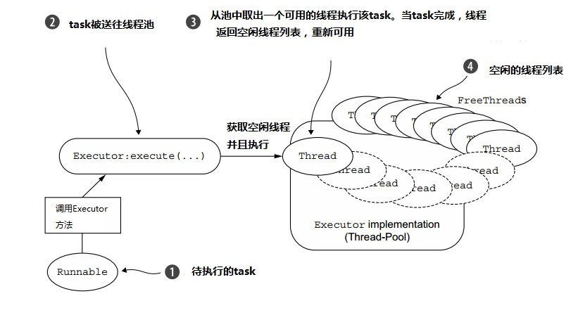
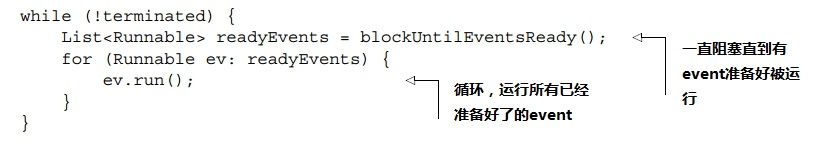
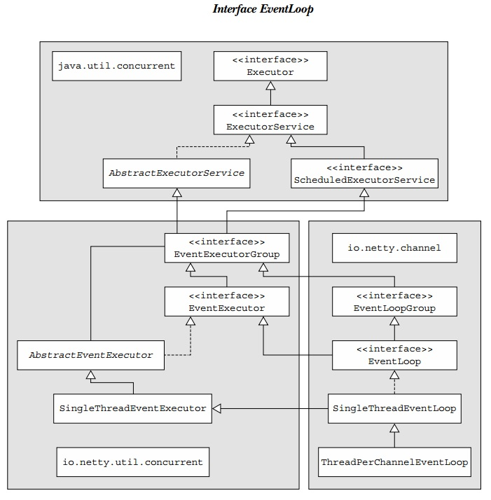
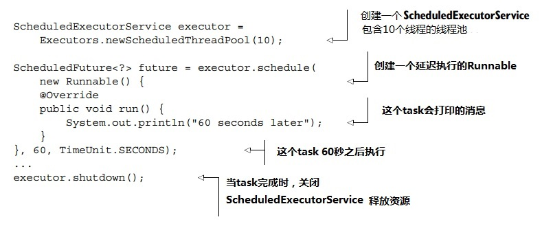
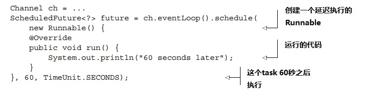
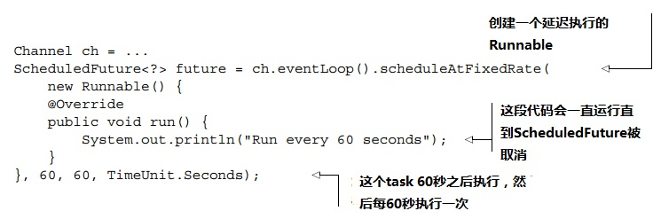
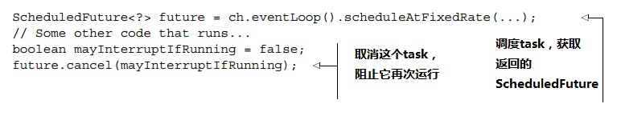
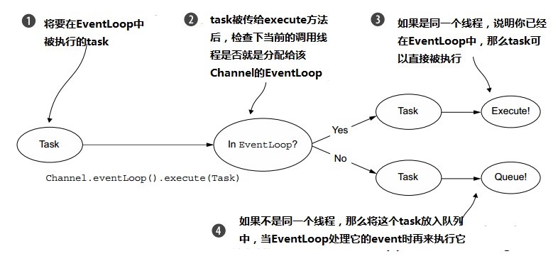
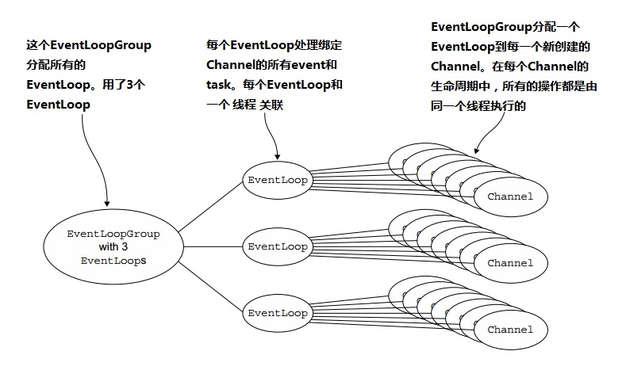
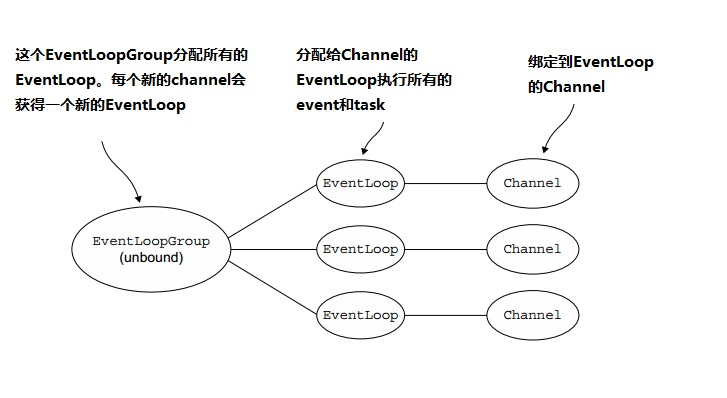

## 第七章   EventLoop和线程模型

### 本章包含

    线程模型概览
    Event Loop的概念和实现
    Task调度
    实现详解

 

简单来说，线程模型定义了操作系统，编程语言，框架或者应用程序线程管理的关键部分。线程是如何、何时被创建的，显然对代码的执行有很大的影响。因此，开发者需要理解不同线程模型中存在的权衡利弊。无论他们是直接为自己选择模型，还是通过用一种语言或者框架隐性地来选择模型，这一点都是毋庸置疑的。

 

在这一章我们会详细探讨Netty的线程模型。Netty线程模型很强大，不过用起来很简单。Netty总是一如既往地简化你的应用代码，最大化应用的性能和可维护性。我们还会讨论到我们是如何选择Netty当前模型的整个过程。

 

如果你对Java并发API（java.util.concurrent）有一个大致的了解，你会感觉本章的讨论很清晰明了。如果你对这些概念不熟悉，或者需要再回忆下，Brian Goetz和其他人合著的《Java并发编程实战》是个很棒的资源。

 

### 7.1 线程模型概览

在这一小节我们会大体上介绍下线程模型，然后讨论下Netty过去和现在采用的线程模型，并且回顾下两种模型各自的优势和限制。

 

我们在本章开头提到的，一个线程模型决定了代码将如何被执行。因为我们必须始终防范并发执行可能带来的副作用，所以理解线程模型的真正含义是很重要的（还有单线程模型）。忽略这些事，仅仅希望获得最好的结果跟赌博没什么两样——如你所愿的机会很渺茫。

 

因为多核或者多CPU的电脑很普遍，现代应用程序大部分都采用复杂的多线程技术来充分利用系统资源。但是相比之下，在Java早期，我们的多线程策略只不过是按需要创建和启动新的Thread，来执行并发的工作任务单元，这个粗糙的策略在高负载下表现得非常糟糕。然后Java5引入了Executor API，通过线程缓存和复用，线程池极大地提高了性能。

 

基本的线程池模式描述如下：

    从池中空闲的线程中选出一个，分配一个提交的task（一个Runnable的实现）
    当task完成，线程返回池中，等待复用（下一次task分配）

 

这个模式如图7.1所示。

 

**图7.1 Executor执行逻辑**

相比为每个task都创建和销毁一个线程，将线程放入池中、复用线程是一次性能的提升。但是这个模型还是无法消除上下文切换带来的开销，而这一点会随着线程数量的增加变得明显，在高负载下会变得严重。此外，在一个项目的运行过程中，因为某个应用的整体复杂度和并发需求，其他线程相关的问题也会出现。

 

总之，多线程是复杂的。在下面的小节里，我们会看到Netty是如何帮助你简化它的。

 

### 7.2 EventLoop接口

运行task来处理一个连接在生命周期中产生的event，是任何一个网络框架的基本功能。其相应的编程结构通常被称为一个event loop， Netty采纳了这个名字，设计了接口io.netty.channel.EventLoop。

 

一个event loop的基本构想如下代码所示，代码中的每个task都是一个Runnable实例（如图7.1）

 

**代码清单7.1 在一个event loop中执行task**

Netty的EventLoop是协作设计(collaborative design )的一部分，这个设计用到了两类基本的API：并发和网络（concurrency and networking）。首先，io.netty.util.concurrent包是基于JDK包java.util.concurrent创建的，以此来提供thread executor。其次，io.netty.channel中的类扩展了这两个包的一些接口，来和Channel的event相连接。类层次结构如图7.2所示。

 

**图7.2 EventLoop 类层次结构**

在这个模型中，EventLoop始终由一个线程驱动，task（Runnable或者Callable）可以直接提交到EventLoop实现即刻或者延后执行。根据配置和可用的CPU核，可以创建多个EventLoop来优化资源利用，并且一个EventLoop可以被指派来服务多个Channel。

 

注意Netty的EventLoop扩展了ScheduleExecutorService，但它自己只定义了一个方法，parent(). 如下面代码片段所示，这个方法返回一个当前EventLoop实例所属的EventLoopGroup引用。

Machine generated alternative text: public interface EventLoop extends EventExecutor, EventLoopGroup { @Override EventLoopGroup parent Q;

EVENT/TASK 执行顺序  Event和Task按FIFO（先进先出）的顺序执行。这保证字节内容按正确的顺序被处理，免除了数据被破坏的可能性。

 

#### 7.2.1  Netty 4中的I/O和event处理

我们在第六章详细描述过，I/O操作触发的event穿过一个包含一个或者多个ChannelHandler的ChannelPipeline。传递event的方法被ChannelHandler拦截，event按需被处理。

 

一个event的本质决定了它将如何被处理；它可能从网络协议栈传送数据到你的应用，或者反过来，或者做一些完全不一样的事情。但是event处理逻辑必须足够通用和灵活，来对付所有可能的情况。所以，在Netty4，所有的I/O操作和event都是由分配给EventLoop的那一个Thread来处理的。

 

这个和Netty3用的模型不一样。在下一节我们会讨论之前的模型以及为什么它被替换掉了。

 

#### 7.2.2 Netty3 的I/O操作

之前发布版本里的线程模型只保证输入（之前被称为upstream）event会在所谓的I/O线程（即Netty4的EventLoop）中执行。所有输出（downstream）event被I/O或者其他任何线程处理。一开始，这个做法看起来不错，但是后来发现有问题：因为ChannelHandler中的输出event需要加上同步。简单来说，我们不能保证多个线程不会试图同时去获取一个输出event。这是有可能发生的，比如说，当你在不同的线程中，在同一个Channel上调用Channel.write()，触发了并行的输出event。

 

当一个输出event引发了一个输入event，另一个问题发生了。比如，当Channel.write()发生了异常，你需要产生并且触发一个exceptionCaught event。但是在Netty3的模型里，因为这是一个输入event，结果就成了你在调用线程中执行Channel.write()代码，然后把产生的异常event交给I/O线程来执行，造成了一次额外的上下文切换。

 

Netty4采用的线程模型，在同一个线程的EventLoop中处理所有发生的事，解决了这两个问题。这个模型提供了一个更加简单的执行结构，省去了ChannelHandler间同步的麻烦（除了那些需要在多个Channel间共享的情况）。

 

既然现在你已经理解了EventLoop担当的角色，让我们来看下task如何被调度执行。

 

### 7.3 任务调度

有时候你需要安排一个task延迟或者周期执行。比如，你可能会想注册一个task，在客户端连接5分钟后被执行。一个常见的做法是发送心跳消息包到远端来检查连接是否还在；如果没有响应，你就知道你可以关闭这个channel了。

 

在下面的小节里，我们会展示如何用Java API和Netty的EventLoop来调度task。然后，我们会研究下Netty内部的实现，讨论它的优势和局限。

 

#### 7.3.1 JDK 调度API

Java5之前，任务调度是建立在java.util.Timer的基础上的，这个类用了一个后台线程，和标准线程有同样的限制。之后，JDK提供了java.util.concurrent包，定义了接口ScheduledExecutorService。表7.1是java.util.concurrent.Executors相关的工厂方法。

 

**表7.1 java.util.concurrent.Executors工厂方法**

| 方法 | 描述 |
| -------- | -------- |
| newScheduledThreadPool(int corePoolSize) newScheduledThreadPool(int corePoolSize,ThreadFactorythreadFactory) | 创建一个ScheduledThreadExecutorService，可以调度命令使其延迟或者周期性执行。它用corePoolSize参数来决定线程池中的线程数量 |
| newSingleThreadScheduledExecutor()  newSingleThreadScheduledExecutor(ThreadFactorythreadFactory) | 创建一个ScheduledThreadExecutorService，可以调度命令使其延迟或者周期性执行。它用一个线程来执行调度的任务。|

 

虽然没有太多的选择，但是提供的这几个方法已经足够应付大多数情况。下面的代码说明了如何用ScheduledExecutorService来运行一个延迟60秒的task。

 

**代码清单7.2 用ScheduledExecutorService调度task**

 

虽然ScheduledExecutorService API用起来很简单，但是在高负载情况下它会带来性能的损失。在下一小结我们会看到Netty是如何用更高的效率提供了同样的功能。

 

#### 7.3.2 用EventLoop调度task

ScheduledExecutorService 的实现有一些局限，比如，额外的线程需要被创建来用于线程池的管理。如果很多task被调度，这一点会成为性能的瓶颈。通过采用channel的EventLoop来实现调度，Netty解决了这个问题，如下代码所示。

 

**代码清单7.3 用EventLoop调度task**

 

60秒后，这个Runnable实例会被channel绑定的EventLoop执行。如果要让这个task每60秒跑一次，用scheduleAtFixedRate()方法，如下所示。

 

**代码清单7.4  用EventLoop调度循环执行的task**

 

我们之前注意到，Netty的EventLoop扩展了ScheduledExecutorService（见图7.2），所以EventLoop提供了JDK包含的所有方法，包括schedule()和scheduleAtFixedRate()，如上述例子所示。完整的操作可以在ScheduledExecutorService的Javadocs中找到。

 

为了取消task或者检查task执行的状态，利用每个异步操作都会返回的ScheduledFuture。下面的代码说明了一个简单的取消操作。

 

**代码清单 7.5 用ScheduledFuture取消一个task**

这些例子说明了利用Netty的调度能力我们可以获得的性能收益。然而，这都依赖于底层的线程模型。下面我们就来研究下它。

 

### 7.4 实现细节

这一小节会详细说明Netty线程模型和任务调度的关键部分。我们还会提到需要注意的一些限制，以及正在进行开发的部分。

 

#### 7.4.1 线程管理

Netty线程模型的出色性能取决于判断当前执行线程是谁；也就是说，它是否是绑定到当前Channel和EventLoop的线程。（回忆下，EventLoop负责处理一个Channel在整个生命周期中的所有event）

 

如果当前调用线程(calling thread)就是分配给该Channel的EventLoop，代码被执行。否则，EventLoop将task放入一个内部的队列延后执行。当EventLoop处理它的event时，它会执行队列中的这些task。这就解释了为何任何线程都可以直接和Channel交互，而不需要为ChannelHandler加上同步。

 

注意每个EventLoop都有它自己task队列，独立于其他任何一个EventLoop。图7.3是EventLoop用来调度task的执行逻辑。这是Netty线程模型的一个关键部分。

 

**图7.3 EventLoop执行逻辑**

 

之前我们已经强调过了不能阻塞当前I/O线程的重要性。现在我们换一种方式再说一遍：“永远不要把一个长时间运行的task放到执行的队列中，因为这会阻塞同一个线程中其他task的执行。”如果你必须要执行阻塞调用或者执行长时间运行的task，我们建议采用一个专门的EventExecutor。（请看6.2.1小节中“ChannelHandler执行和阻塞”的补充说明。）

 

撇开这样一个限制情况不说，Netty采用的线程模型可以影响队列task对整个系统性能产生的效果，也可以影响传输方式采用的event处理方式。（像我们在第四章看到的，不用改变你的代码库，Netty让传输方式的切换变得很容易）

 

#### 7.4.2 Eventloop/线程的分配

为Channel的I/O和event提供服务的EventLoop都包含在一个EventLoopGroup中。EventLoop创建和分配的方式根据传输实现的不同而有所不同。

 

**异步传输**

异步实现只用了很少几个EventLoop（和它们关联的线程），在目前Netty的模型中，这几个EventLoop被所有Channel共享。这让很多Channel被最少数量的线程服务，而不是每个Channel分配一个线程。

 

图7.4展现了一个包含3个固定EventLoop（每个都由一个线程驱动）的EventLoopGroup。这些EventLoop（和它们的线程）在EventLoopGroup创建时就已经创建好了，以确保这些EventLoop在需要时就可以立即被拿来用。

 

**图7.4 针对非阻塞传输的EventLoop分配（比如NIO和AIO）**

 

EventLoopGroup负责分配一个EventLoop到每个新创建的Channel。在目前的实现中，采用循环(round-robin)策略可以满足一个平衡的分配，同一个Eventloop还可能会被分配到多个Channel。（在未来的版本，这一点可能会改变。）

 

一但Channel被指派了一个EventLoop，在它的整个生命周期过程中，都会用这个EventLoop（及其关联的线程）。记住这一点，因为这让你不用担心线程安全和实现ChannelHandler中的同步问题。

 

还有，注意EventLoop分配对ThreadLocal使用带来的影响。因为一个EventLoop通常掌管多个Channel，所以ThreadLocal对所有绑定的Channel都是同一个。实现譬如状态跟踪等功能时，ThreadLocal就成了一个槽糕的选择。但是，在一个无状态的上下文中，对于在Channel间共享大对象，或者创建开销大的对象，甚至是event时，ThreadLocal仍然有用。

 

**阻塞传输**

针对其他传输比如OIO（老版阻塞I/O）的EventLoop分配设计有点不同，如图7.5所示。

 

**图7.5 针对阻塞传输的EventLoop分配（比如OIO）**

在这里，每个Channel都分配了一个EventLoop（和它的线程）。如果你开发过调用java.io包中的阻塞I/O的应用，你也许会碰到过这种模式。

 

但是像之前（异步传输）看到的一样，这个模式保证了每个Channel的I/O event只被一个线程处理——就是分配给Channel的EventLoop。这又是一个Netty设计一致性的例子；这个设计同时也有助于Netty的可靠性和易用性。

 

 

### 7.5 小结

在这一章，你先学习了线程模型概览，然后我们详细讨论了Netty线程模型的性能和设计一致性。

 

你看到了如何在EventLoop（I/O线程）中执行你的task（Netty框架自己也是这么做的）。你学会了如何延迟执行task，并且我们还研究了高负载下可扩展性的问题。你还看到了如何验证一个task是否已经执行以及如何取消它。

 

这些信息，加上我们学习过的这个框架的实现细节，将帮助你在简化现有代码时实现最大的性能。更多关于线程池和并发编程的信息，我们推荐阅读Brain Goetz的《Java并发编程实践》。他的这本书会让你更深入地了解即便是那些最复杂的多线程用例。

 

我们已经来到了一个令人兴奋的时刻——在下一章我们会讨论bootstrapping，这是一个通过配置和连接所有Netty组件来激活你的应用的过程。
